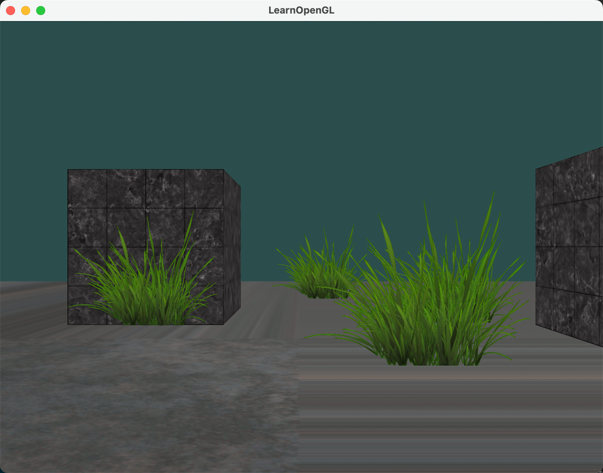
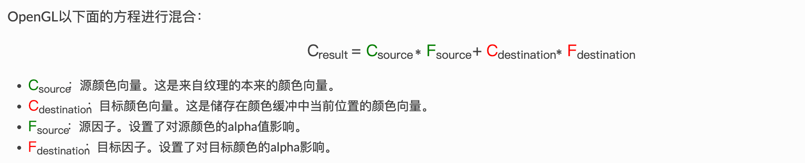
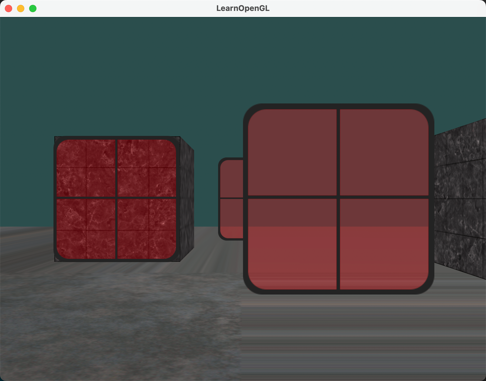

前面几个教程，我们都是用的一个点货一个物体作为光源，但是现实生活中，并不只有点光源。今天就带大家继续学习 OpenGL 中的三大光源 —— 定向光、点光源和聚光灯。不管你是不是初学者，跟着这篇文章一步步来，保证你能快速上手，打造出炫酷的光照效果！

## 1. 定向光：模拟太阳光

定向光就是所有光线都平行的光源，就像太阳光一样。当一个光源被设置为无限远时，它被称为定向光(Directional Light)，因为所有的光线都有着同一个方向，它会独立于光源的位置。



### 1.1 修改片段着色器

还记得我们之前设置的光照方向吗？

```glsl
struct Light
{
    vec3 position;
    vec3 ambient;
    vec3 diffuse;
    vec3 specular;
};

......

vec3 lightDir = normalize(light.position - outFragPos);
```

对于定向光，因为所有光线都是平行的，所以每个片段上光的方向一致，不再需要通过光源位置来计算方向了。因此，修改如下：

```glsl
struct Light
{
    // vec3 position; // 现在不在需要光源位置了，因为它是无限远的
    vec3 direction;
    vec3 ambient;
    vec3 diffuse;
    vec3 specular;
};

......

vec3 lightDir = normalize(light.position - outFragPos);
```

首先，我们要定义一个光的方向向量，而不是位置。比如，你可以这样写：

```glsl
struct Light {
    vec3 direction; // 光的方向向量
    vec3 ambient;   // 环境光强度
    vec3 diffuse;   // 漫反射光强度
    vec3 specular;  // 镜面反射光强度
};

......

vec3 lightDir = normalize(-light.direction);
```

在这里，对方向向量取反并标准化，得到光源方向：

```glsl
vec3 lightDir = normalize(-light.direction);
```

为啥要取反呢？因为通常我们习惯定义光的全局方向是从光源发出的，但计算光照时需要从片段指向光源的方向。取反后，它就变成了指向光源的方向了。


### 1.2 主程序中设置定向光

在主程序中，将光的方向传递进来：

```cpp
ourShader.setVec3("light.direction", lightDir);
```

### 1.3 增加几个物体展示定向光对所有物体都有同样的影响

下面我们增加几个物体，展示定向光对所有物体都有同样的影响。增加几个物体，只要更改每个物体的模型矩阵即可。

（1）给定几个物体的偏移量，这样它们看起来不会重叠。

```cpp
glm::vec3 cubePositions[] = {
    glm::vec3( 0.0f,  0.0f,  0.0f),
    glm::vec3( 2.0f,  5.0f, -15.0f),
    glm::vec3(-1.5f, -2.2f, -2.5f),
    glm::vec3(-3.8f, -2.0f, -12.3f),
    glm::vec3( 2.4f, -0.4f, -3.5f),
    glm::vec3(-1.7f,  3.0f, -7.5f),
    glm::vec3( 1.3f, -2.0f, -2.5f),
    glm::vec3( 1.5f,  2.0f, -2.5f),
    glm::vec3( 1.5f,  0.2f, -1.5f),
    glm::vec3(-1.3f,  1.0f, -1.5f)
};
```

（2）在渲染循环中，使用不同的模型矩阵来渲染每个物体。

```cpp
glBindVertexArray(VAO);
for(GLuint i = 0; i < 10; i++)
{
    model = glm::mat4();
    model = glm::translate(model, cubePositions[i]);
    GLfloat angle = 20.0f * i;
    model = glm::rotate(model, angle, glm::vec3(1.0f, 0.3f, 0.5f));
    ourShader.setMat4("model", model);
    glDrawArrays(GL_TRIANGLES, 0, 36);
}
glBindVertexArray(0);
```


### 1.4 运行程序，看看效果！





## 2. 点光源：带衰减的灯光

点光源就像灯泡一样，在某个位置向四周发光，而且光线会随着距离变远而变暗，这种衰减效果让场景更真实。


前面的教程其实我们使用的就是点光源，只是没有设置衰减项。今天我们就来学习如何设置点光源的衰减效果。

### 2.1 衰减

#### 2.1.1 概念和公式

随着光线穿越距离的变远使得亮度也相应地减少的现象，通常称之为衰减(Attenuation)。一种随着距离减少亮度的方式是使用线性等式。这样的一个随着距离减少亮度的线性方程，可以使远处的物体更暗。然而，这样的线性方程效果会有点假。在真实世界，通常光在近处时非常亮，但是一个光源的亮度，开始的时候减少的非常快，之后随着距离的增加，减少的速度会慢下来。我们需要一种不同的方程来减少光的亮度。



在这里d代表片段到光源的距离。为了计算衰减值，我们定义3个（可配置）项：常数项Kc，一次项Kl和二次项Kq。

- 常数项通常是1.0，它的作用是保证分母永远不会比1小。
- 一次项用于与距离值相乘，这会以线性的方式减少亮度。
- 二次项用于与距离的平方相乘，为光源设置一个亮度的二次递减。二次项在距离比较近的时候相比一次项会比一次项更小，但是当距离更远的时候比一次项更大。


#### 2.1.2 可配置项如何确定？

可配置项值的设置由很多因素决定：环境、你希望光所覆盖的距离范围、光的类型等。大多数场合，这是经验的问题，也要适度调整。下面的表格展示一些各项的值，它们模拟现实（某种类型的）光源，覆盖特定的半径（距离）。第一栏定义一个光的距离。


### 2.2 实现衰减

先定义光源的位置，还有三个衰减项：常数项、一次项和二次项。直接看代码：

```glsl
struct Light {
    vec3 position;   // 光源位置
    vec3 ambient;    // 环境光强度
    vec3 diffuse;    // 漫反射光强度
    vec3 specular;   // 镜面反射光强度
    float constant;  // 常数衰减项
    float linear;    // 一次衰减项
    float quadratic; // 二次衰减项
};
```

注意这里是点光源了，所以片段Light结构体中还是光源的位置，而不是平行光时的方向。

然后在主程序中，设置光源的衰减项：

```cpp
ourShader.setFloat("light.constant", 1.0f);
ourShader.setFloat("light.linear", 0.09f);
ourShader.setFloat("light.quadratic", 0.032f);
```

最后，在片段着色器中，计算衰减参数，加入到最后的光照结果中去：

```glsl
float distance = length(light.position - FragPos);
float attenuation = 1.0f / (light.constant + light.linear * distance + light.quadratic * (distance * distance));

vec3 finalColor = (diffuseambient + ambientdiffuse + specular) * attenuation;
```

### 2.3 运行程序，看看效果！


这样，离光源近的物体亮，远的暗，效果是不是很逼真？就像真的灯泡在发光一样！

## 3. 聚光灯：手电筒效果

聚光灯(Spotlight)只朝一个方向照射，形成一个圆锥形的光照区域，就像手电筒一样。这种光源用好了，能给你的场景增添很多神秘感和层次感。


OpenGL中的聚光用世界空间位置，一个方向和一个指定了聚光半径的切光角来表示。我们计算的每个片段，如果片段在聚光的切光方向之间（就是在圆锥体内），我们就会把片段照亮。

- LightDir：从片段指向光源的向量。
- SpotDir：聚光所指向的方向。
- Phiϕ：定义聚光半径的切光角。每个落在这个角度之外的，聚光都不会照亮。
- Thetaθ：LightDir向量和SpotDir向量之间的角度。θ值应该比Φ值小，这样才会在聚光内。

所以我们大致要做的是，计算LightDir向量和SpotDir向量的点乘（返回两个单位向量的点乘，还记得吗？），然后在和切光角ϕ对比。

### 3.1 修改光源结构体

在光源结构里加上方向向量和切光角：

```glsl
struct Light {
    vec3 position;   // 光源位置
    vec3 direction;  // 光源方向
    float cutOff;    // 切光角（内圆锥角度的余弦值）
    // 其他光照参数...
};
```

### 3.2 主程序中设置聚光灯方向和切光角


### 2. 实现聚光灯效果

在片段着色器里，计算光线方向和聚光方向的点乘，判断是否在光照范围内：

```glsl
vec3 lightDir = normalize(light.position - FragPos);
float theta = dot(lightDir, normalize(-light.direction));

if(theta > light.cutOff) {
    // 在光照范围内，计算光照
} else {
    // 不在光照范围内，只保留环境光
    color = vec4(light.ambient * vec3(texture(material.diffuse, TexCoords)), 1.0);
}
```

为了让边缘更平滑，还可以加上外圆锥的计算：

```glsl
float epsilon = light.cutOff - light.outerCutOff;
float intensity = clamp((theta - light.outerCutOff) / epsilon, 0.0, 1.0);
```

然后把强度值乘到光照上，就能实现平滑过渡的聚光灯效果啦！

## 四、组合运用，打造梦幻场景！

把这三种光源结合起来，就能创造出超棒的光照效果。比如，用定向光模拟太阳光作为整体光照，再加几个点光源做局部装饰，最后用聚光灯突出重点物体，整个场景立马立体感十足，氛围感拉满！

宝子们，赶紧动手试试吧！按照这些步骤，你也能轻松做出炫酷的 OpenGL 作品。如果在学习过程中有任何问题，欢迎随时留言交流，一起探讨更多有趣的技巧！