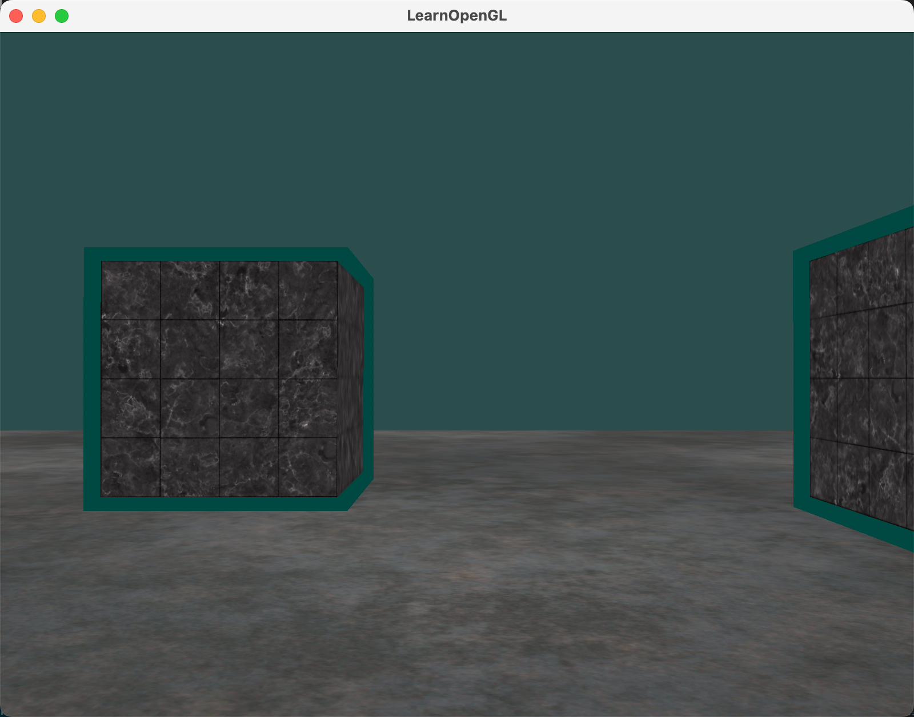

👀 看过来！今天教你如何让3D物体更真实。今天咱们来聊一聊 OpenGL 中的材质(Material)！在 3D 世界里，材质可是让物体看起来真实的关键。想象一下，一个木头箱子和一个钢箱子，它们对光的反应可是完全不一样的。木头可能看起来比较柔和，而钢则会闪闪发光。

## 1. 什么是材质(Material)？

简单来说，材质就是物体对光的反应特性。不同的材质会有不同的反射、折射和散射效果。在 OpenGL 中，我们可以通过设置材质属性来模拟这些效果。

## 2. OpenGL 中定义一个材质属性

### 2.1 材质属性包含的内容
前面文章中，我们已经知道了光照的组成要素：

- 环境光（Ambient Lighting）：这是物体在环境光下的基本颜色。通常和物体的颜色相同。
  
- 漫反射光（Diffuse Lighting）：这是物体在光源照射下的主要颜色。它决定了物体的“真实感”。

- 镜面光（Specular Lighting）：这是物体表面的高光部分。它让物体看起来更有光泽。
这里面还包含一个 光泽度（Shininess），它决定了高光的大小和强度。

每个材质本质上是上面这些光照属性不同，所以为每个材质定义一套上面的属性，就是在 OpenGL 中定义了一个材质属性。这里有一个列表 [devernay.free.fr](http://devernay.free.fr/cours/opengl/materials.html) 展示了几种材质属性，这些材质属性模拟外部世界的真实材质。下面的图片展示了几种真实世界材质对我们的立方体的影响：


### 2.2 实操 - 在片段着色器中定义材质属性

（1）在片段着色器中定义一个材质结构体，然后声明成 uniform 变量，让其可以从外部设置：

```glsl
struct Material {
    vec3 ambient;
    vec3 diffuse;
    vec3 specular;
    float shininess;
};
uniform Material material;
```

（2）然后，在片段着色器中，我们可以根据材质属性来计算光照效果 (物体的每个材质属性都乘以它们对应的光照元素) ：

```glsl
void main()
{
    // 环境光
    vec3 ambient = material.ambient * lightColor;

    // 漫反射光
    vec3 lightDir = normalize(lightPos - outFragPos);
    vec3 normal = normalize(outNormal);
    float diff = max(dot(lightDir, normal), 0.0);
    vec3 diffuse = material.diffuse * diff * lightColor;

    // 镜面光
    vec3 viewDir = normalize(viewPos - outFragPos);
    vec3 reflectDir = reflect(-lightDir, outNormal);
    float diff_spec = max(dot(viewDir, reflectDir), 0.0);
    float spec = pow(diff_spec, material.shininess);
    vec3 specular = material.specular * spec * lightColor;

    vec3 finalColor = diffuse * objectColor + ambient * objectColor + specular * objectColor;

    FragColor = vec4(finalColor, 1.0);
}
```

（3）最后，在cpp中将材质属性传递过来：

```cpp
ourShader.setVec3("material.ambient", glm::vec3(1.0f, 0.5f, 0.31f));
ourShader.setVec3("material.diffuse", glm::vec3(1.0f, 0.5f, 0.31f));
ourShader.setVec3("material.specular", glm::vec3(1.0f, 0.5f, 0.31f));
ourShader.setFloat("material.shininess", 32.0f);
```

这样，我们就为物体设置了一个基本的材质属性。

（4）运行结果


但是，这个物体太亮了。物体过亮的原因是环境、漫反射和镜面三个颜色任何一个光源都会去全力反射。实际上，光源对环境、漫反射和镜面元素同时具有不同的强度，而我们使用了相同的光照强度：`lightColor`。现在都是1.0，但是实际上，例如环境元素不应该对最终颜色有这么大的影响，所以我们要设置光的ambient亮度为一个小一点的值，从而限制环境色，所以，我们还需要一个光照属性。

## 3. 光的属性

（1）与材质类似，我们也在片段着色器中为光的属性创建一个结构体：

```glsl
struct Light
{
    vec3 position;
    vec3 ambient;
    vec3 diffuse;
    vec3 specular;
};
uniform Light light;
```

（2）然后在片段着色器中，我们使用光的属性来计算光照效果：

```glsl
void main()
{
    // 环境光
    vec3 ambient = material.ambient * light.ambient;

    // 漫反射光
    vec3 lightDir = normalize(light.position - outFragPos);
    vec3 normal = normalize(outNormal);
    float diff = max(dot(lightDir, normal), 0.0);
    vec3 diffuse = material.diffuse * diff * light.diffuse;

    // 镜面光
    vec3 viewDir = normalize(viewPos - outFragPos);
    vec3 reflectDir = reflect(-lightDir, outNormal);
    float diff_spec = max(dot(viewDir, reflectDir), 0.0);
    float spec = pow(diff_spec, material.shininess);
    vec3 specular = material.specular * spec * light.specular;

    vec3 finalColor = diffuse * objectColor + ambient * objectColor + specular * objectColor;

    FragColor = vec4(finalColor, 1.0);
}
```

（3）在cpp中，我们设置光的属性：

```cpp
ourShader.setVec3("light.ambient", glm::vec3(0.2f, 0.2f, 0.2f) * lightColor);
ourShader.setVec3("light.diffuse", glm::vec3(0.5f, 0.5f, 0.5f) * lightColor);
ourShader.setVec3("light.specular", glm::vec3(1.0f, 1.0f, 1.0f));
ourShader.setVec3("light.position", lightPos);
```

（4）运行结果


## 4. 不同的光源颜色

前面我们都是调整的光照强度，我们还可以通过改变光源的颜色来影响物体的外观。比如，我们可以让光源的颜色随着时间变化，创造出非常有趣的效果：

```cpp
glm::vec3 lightColor;
lightColor.x = sin(glfwGetTime() * 2.0f);
lightColor.y = sin(glfwGetTime() * 0.7f);
lightColor.z = sin(glfwGetTime() * 1.3f);
```

这样一来，物体的颜色就会随着光源的变化而变化，效果非常炫酷！



## 5. 补充

刚开始学，可能大家与我有一样的困惑。材质属性和光照属性中，为什么会有这么多相似的属性？他们有什么区别？下面来解释一下。

在 OpenGL 的光照计算中，vec3 ambient、vec3 diffuse 和 vec3 specular 同时出现在材质（Material）和光照（Light）的属性中，但它们分别代表不同的概念：

### 5.1 光照属性（Light）

（1）vec3 ambient

- 作用：定义环境光（Ambient Light）对物体的贡献（强度和颜色）。

（2）vec3 diffuse

- 作用：定义漫反射光（Diffuse Light）的强度和颜色。

（3）vec3 specular

- 作用：定义镜面光（Specular Light）的强度和颜色。

### 5.2 材质属性（Material）

（1）vec3 ambient

- 作用：定义物体在环境光下的反射特性。

（2）vec3 diffuse

- 作用：定义物体在漫反射光下的反射特性。

（3）vec3 specular

- 作用：定义物体在镜面光下的反射特性。

总的来说，光照属性（Light）：描述的是光源本身的特性，包括环境光、漫反射光和镜面光的强度和颜色。材质属性（Material）：描述的是物体对这些光照的反射特性，即物体如何响应光源的环境光、漫反射光和镜面光。

它们的乘积决定了物体最终的显示效果。例如，物体的环境光照部分是 light.ambient * material.ambient，漫反射光照部分是 light.diffuse * material.diffuse，镜面光照部分是 light.specular * material.specular。

通过调整这些属性，可以模拟不同的光照条件和物体材质，从而创造出丰富多彩的 3D 场景。

