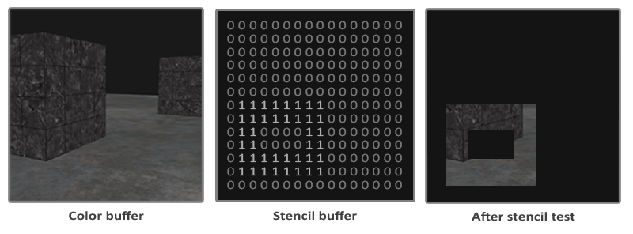
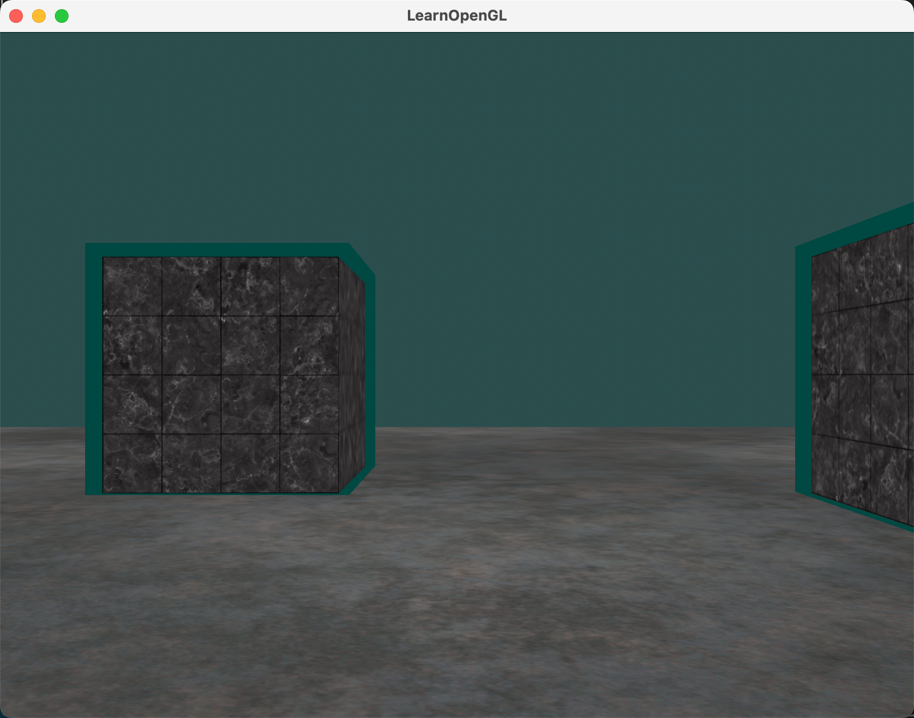

今天继续学习OpenGL高级部分 - 模版测试原理与使用。

## 1. 模版测试原理

在图形渲染管线中，当片段着色器完成处理后，模板测试环节会基于特定算法对图像元素进行筛选。这种筛选机制通过一个被称为模板缓冲(Stencil Buffer)的特殊存储区域实现，其功能机制与深度测试类似。模板缓冲的每个存储单元通常采用8位数据表示（取值范围0-255），开发者可以通过这些定制化的数值建立精确的筛选规则。

下面是一个模板缓冲的简单例子：



模板缓冲先清空模板缓冲设置所有片段的模板值为0，然后开启矩形片段用1填充。场景中的模板值为1的那些片段才会被渲染（其他的都被丢弃）。

## 2. 模版测试的使用

### 2.1 启用模版测试

通过指令 `glEnable(GL_STENCIL_TEST)` 激活模板测试功能

与颜色缓冲、深度缓冲的初始化规则类似，需在每个渲染循环中执行清空操作：

```cpp
glClear(GL_COLOR_BUFFER_BIT | GL_DEPTH_BUFFER_BIT | GL_STENCIL_BUFFER_BIT);
```

### 2.2 写入权限控制

使用 `glStencilMask` 函数精确控制缓冲写入权限：

- 全权限模式(0xFF)：允许8位全字段写入
- 锁定模式(0x00)：完全禁用数据写入

```cpp
// 0xFF == 0b11111111
//此时，模板值与它进行按位与运算结果是模板值，模板缓冲可写
glStencilMask(0xFF); 

// 0x00 == 0b00000000 == 0
//此时，模板值与它进行按位与运算结果是0，模板缓冲不可写
glStencilMask(0x00); 
```

### 2.3 模板函数

与深度测试一样，模板测试也有几个不同的控制权，决定何时模板测试通过或失败以及它怎样影响模板缓冲。一共有两种函数可供我们使用去配置模板测试：`glStencilFunc` 和 `glStencilOp`。

（1）测试规则设置函数 (glStencilFunc)

函数原型：`void glStencilFunc(GLenum func, GLint ref, GLuint mask)`

函数参数：

- func：测试运算符（GL_NEVER、GL_LEQUAL、GL_GREATER、GL_GEQUAL、GL_EQUAL、GL_NOTEQUAL、GL_ALWAYS。它们的语义和深度缓冲的相似）
- ref：指定模板测试的引用值。模板缓冲的内容会与这个值对比。
- mask：指定一个遮罩，在模板测试对比引用值和储存的模板值前，对它们进行按位与（and）操作，初始设置为1。

示例：

```cpp
glStencilFunc(GL_EQUAL, 1, 0xFF); //精确匹配特定数值
```

这行代码的含义：一个片段模板值等于(GL_EQUAL)引用值1，片段就能通过测试被绘制了，否则就会被丢弃。

（2） 缓冲更新函数 (glStencilOp)

函数原型：`void glStencilOp(GLenum sfail_action, GLenum dpfail_action, GLenum dppass_action)`

函数参数：

- sfail： 如果模板测试失败将采取的动作。
- dpfail： 如果模板测试通过，但是深度测试失败时采取的动作。
- dppass： 如果深度测试和模板测试都通过，将采取的动作。

每个参数都是一个操作选项，典型操作选项包含：

- GL_KEEP	保持现有的模板值
- GL_ZERO	将模板值置为0
- GL_REPLACE	将模板值设置为用glStencilFunc函数设置的ref值
- GL_INCR	如果模板值不是最大值就将模板值+1
- GL_INCR_WRAP	与GL_INCR一样将模板值+1，如果模板值已经是最大值则设为0
- GL_DECR	如果模板值不是最小值就将模板值-1
- GL_DECR_WRAP	与GL_DECR一样将模板值-1，如果模板值已经是最小值则设为最大值
- GL_INVERT	Bitwise inverts the current stencil buffer value.

默认设置为 (GL_KEEP, GL_KEEP, GL_KEEP) ，所以任何测试的任何结果，模板缓冲都会保留它的值。默认行为不会更新模板缓冲，所以如果你想写入模板缓冲的话，你必须像任意选项指定至少一个不同的动作。

## 3. 实践：三维物体描边

### 3.1 总体步骤

给物体加上轮廓的步骤如下：

（1）在绘制物体前，把模板方程设置为GL_ALWAYS，用1更新物体将被渲染的片段。

（2）渲染物体，写入模板缓冲。

（3）关闭模板写入和深度测试。

（4）每个物体放大一点点。

（5）使用一个不同的片段着色器用来输出一个纯颜色。

（6）再次绘制物体，但只是当它们的片段的模板值不为1时才进行。

（7）开启模板写入和深度测试。

### 3.2 实现步骤分解

（1）开启模板测试

```cpp
glEnable(GL_STENCIL_TEST);
glStencilMask(0xFF); // 设置模板缓冲为可写状态
```

（2）设置模板、深度测试通过或失败时才采取动作

```cpp
glStencilOp(GL_KEEP, GL_KEEP, GL_REPLACE); //成功绘制时更新模板缓冲数值为ref值
```

（3）设置模版测试规则

```cpp
glStencilFunc(GL_ALWAYS, 1, 0xFF); // GL_ALWAYS 所有片段都要写入模板缓冲；ref 值为1，所以上面如果绘制成功，模板缓冲数值会更新为1

```

（4）绘制箱子，绘制完成后，模板缓冲中所有被绘制的片段的模板值都更新为1

（5）关闭模版缓冲的写入

```cpp
glStencilMask(0x00); // 关闭模板缓冲写入
```

（6）绘制轮廓

```cpp
glStencilFunc(GL_NOTEQUAL, 1, 0xFF); // 筛选出模板值不为1的片段
GLfloat scale = 1.1f;
pureColorShader.use();
pureColorShader.setMat4("view", view);
pureColorShader.setMat4("projection", projection);
model = glm::mat4(1.0f);
glBindVertexArray(cubeVAO);
glActiveTexture(GL_TEXTURE0);
glBindTexture(GL_TEXTURE_2D, cubeTexture); 	
model = glm::translate(model, glm::vec3(-1.0f, 0.0f, -1.0f));
model = glm::scale(model, glm::vec3(scale, scale, scale));
pureColorShader.setMat4("model", model);
glDrawArrays(GL_TRIANGLES, 0, 36);
model = glm::mat4(1.0f);
model = glm::translate(model, glm::vec3(2.0f, 0.0f, 0.0f));
model = glm::scale(model, glm::vec3(scale, scale, scale));
pureColorShader.setMat4("model", model);
glDrawArrays(GL_TRIANGLES, 0, 36);
glBindVertexArray(0);
```

（7）绘制轮廓前，关闭深度测试。这样放大的的箱子也就是边框才不会被地面覆盖。绘制完成后，重新开启深度测试。

```cpp
glDisable(GL_DEPTH_TEST);
```

如果没有关闭深度测试，边框会被地面覆盖掉一点。如下图：



（8）绘制轮廓完成后，重新开启深度测试，重新打开模板缓冲写入权限

```cpp
glEnable(GL_DEPTH_TEST);
glStencilMask(0xFF);
```

重新打开模板缓冲写入权限，以便后续绘制正常物体时，模板缓冲的数值可以更新，否则 glClear 时，无法重置模板缓冲，会出现下图的现象（随着移动箱子，在箱子走过的位置，不会出现任何渲染了，只有背景色了，因为箱子走过的位置，模板缓冲都为1，不会重置）：


（9）最终运行效果：


（10）补充点：

纯色渲染片段着色器代码：

```glsl
#version 330 core

out vec4 color;
void main()
{    
    color = vec4(0.04, 0.28, 0.26, 1.0);
}
```

另外，在绘制立方体前，记得先绘制地面。

## 4. 主要代码片段

```cpp
//循环渲染
while(!glfwWindowShouldClose(window))
{
    float currentFrame = glfwGetTime();
    deltaTime = currentFrame - lastFrame;
    lastFrame = currentFrame;
    
    //检测输入事件
    processInput(window);
    
    //渲染指令
    draw(window);

    glEnable(GL_DEPTH_TEST);
    // glDepthFunc(GL_ALWAYS);  // 模拟关闭深度检测效果
    // glDepthMask(GL_FALSE);   // 启用只读检测模式

    glm::mat4 view;
    view = camera.GetViewMatrix();
    glm::mat4 projection;
    projection = glm::perspective(glm::radians(camera.Zoom), screen_width/screen_height, 0.1f, 100.0f);
    
    ourShader.use();
    ourShader.setMat4("view", view);
    ourShader.setMat4("projection", projection);

    // floor
    glStencilMask(0x00); // 关闭模板缓冲写入
    glBindVertexArray(planeVAO);
    glBindTexture(GL_TEXTURE_2D, floorTexture);
    ourShader.setMat4("view", view);
    ourShader.setMat4("projection", projection);
    ourShader.setMat4("model", glm::mat4(1.0f));
    glDrawArrays(GL_TRIANGLES, 0, 6);
    glBindVertexArray(0);

    // 开启深度测试、模版板测试的情况下绘制立方体，将模板缓冲设置为1
    glEnable(GL_STENCIL_TEST);
    glStencilMask(0xFF); // 设置模板缓冲为可写状态
    glStencilFunc(GL_ALWAYS, 1, 0xFF);
    glStencilOp(GL_KEEP, GL_KEEP, GL_REPLACE);

    // cubes
    glm::mat4 model = glm::mat4(1.0f);
    glBindVertexArray(cubeVAO);
    glActiveTexture(GL_TEXTURE0);
    glBindTexture(GL_TEXTURE_2D, cubeTexture); 	
    model = glm::translate(model, glm::vec3(-1.0f, 0.0f, -1.0f));
    ourShader.setMat4("model", model);
    glDrawArrays(GL_TRIANGLES, 0, 36);
    model = glm::mat4(1.0f);
    model = glm::translate(model, glm::vec3(2.0f, 0.0f, 0.0f));
    ourShader.setMat4("model", model);
    glDrawArrays(GL_TRIANGLES, 0, 36);
    glBindVertexArray(0);

    // 开启深度测试，关闭深度缓冲写入的情况下，绘制放大的立方体，只绘制模板值不为1的片段
    glStencilMask(0x00); // 关闭模板缓冲写入
    glStencilFunc(GL_NOTEQUAL, 1, 0xFF); // 筛选出模板值不为1的片段
    glDisable(GL_DEPTH_TEST);
    GLfloat scale = 1.1f;
    pureColorShader.use();
    pureColorShader.setMat4("view", view);
    pureColorShader.setMat4("projection", projection);
    model = glm::mat4(1.0f);
    glBindVertexArray(cubeVAO);
    glActiveTexture(GL_TEXTURE0);
    glBindTexture(GL_TEXTURE_2D, cubeTexture); 	
    model = glm::translate(model, glm::vec3(-1.0f, 0.0f, -1.0f));
    model = glm::scale(model, glm::vec3(scale, scale, scale));
    pureColorShader.setMat4("model", model);
    glDrawArrays(GL_TRIANGLES, 0, 36);
    model = glm::mat4(1.0f);
    model = glm::translate(model, glm::vec3(2.0f, 0.0f, 0.0f));
    model = glm::scale(model, glm::vec3(scale, scale, scale));
    pureColorShader.setMat4("model", model);
    glDrawArrays(GL_TRIANGLES, 0, 36);
    glBindVertexArray(0);
    glStencilMask(0xFF); // 设置模板缓冲为可写状态
    
    glfwSwapBuffers(window);
    glfwPollEvents();
}
```

**篇幅有限，完整程序可私信我（+v：jasper_8017）获取。**