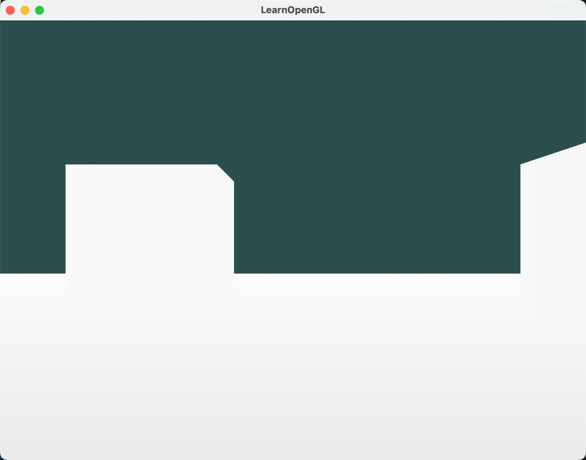
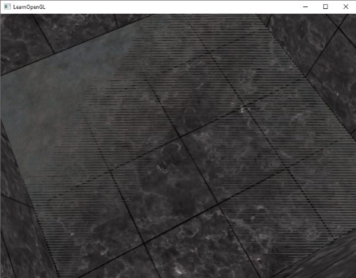

前面我们在刚开始学习绘制立方体时，使用过深度测试，以防止被其他面遮挡的面渲染到前面。今天这篇文章，让我们一起来深入探讨深度缓冲系统的原理与配置方法。

## 1. 深度缓冲系统原理

### 1.1 原理

在三维图形渲染中，深度缓冲机制（Z-buffer）通过存储每个像素的深度信息，有效解决了物体遮挡关系的判定难题。该机制采用16/24/32位浮点精度存储数据，其中24位方案成为行业主流配置。

当深度测试启用的时候， OpenGL 测试深度缓冲区内的深度值。OpenGL 执行深度测试的时候，如果此测试通过，深度缓冲内的值将被设为新的深度值。如果深度测试失败，则丢弃该片段。

### 1.2 检测流程时序

深度检测在图形管线中处于关键位置：

（1）片段着色器完成色彩计算
（2）模板测试执行验证
（3）屏幕空间深度值比对
（4）深度缓冲区动态更新

技术细节：

- 深度测试在屏幕空间中执行，屏幕空间坐标直接有关的视区，由OpenGL的glViewport函数给定。
- 通过gl_FragCoord内置变量获取屏幕坐标
- gl_FragCoord包含了一个Z分量存储实际深度值用于与深度缓冲比对
- 坐标系原点设定在视口左下角(0,0)

## 2. 深度检测功能使用

### 2.1 基础设置指令

```cpp
glEnable(GL_DEPTH_TEST);  // 启用深度检测
glClear(GL_COLOR_BUFFER_BIT | GL_DEPTH_BUFFER_BIT); // 双缓冲清除
```

- 用GL_DEPTH_TEST选项来打开深度测试。

- 在每个渲染之前还应使用GL_DEPTH_BUFFER_BIT清除深度缓冲区，否则深度缓冲区将保留上一次进行深度测试时所写的深度值

### 2.2 只读的深度测试

在某些情况下我们需要进行深度测试并相应地丢弃片段，但我们不希望更新深度缓冲区，OpenGL允许我们通过将其深度掩码设置为GL_FALSE禁用深度缓冲区写入:

```cpp
glDepthMask(GL_FALSE);  // 禁用深度缓冲写入，只在深度测试被启用的时候有效。
```


### 2.3 深度检测策略设置

OpenGL 允许我们修改它深度测试使用的比较运算符(comparison operators)。这样我们能够控制OpenGL通过或丢弃碎片和如何更新深度缓冲区。我们可以通过调用glDepthFunc来设置比较运算符 (或叫做深度函数(depth function)):

```cpp
glDepthFunc(GL_LESS);  // 设置深度检测策略为小于
```

OpenGL提供八种深度比较策略：

|深度函数选项|描述|
|--|--|
|GL_ALWAYS|永远通过测试|
|GL_NEVER|永远不通过测试|
|GL_LESS（默认）|在片段深度值小于缓冲区的深度时通过测试|
|GL_EQUAL|在片段深度值等于缓冲区深度时通过测试|
|GL_LEQUAL|在片段深度值小于或等于缓冲区深度时通过测试|
|GL_GREATER|在片段深度值大于缓冲区深度时通过测试|
|GL_NOTEQUAL|在片段深度值不等于缓冲区深度时通过测试|
|GL_GEQUAL|在片段深度值大于或等于缓冲区深度时通过测试|


## 3. 使用实例 - 代码演示

我们还是回到之前的箱子绘制代码。这次，我们构建一个场景，一个地面，和两个箱子。

### 3.1 主程序修改

（1）箱子和地面的顶点数据

```cpp
float cubeVertices[] = {
    // positions          // texture Coords
    -0.5f, -0.5f, -0.5f,  0.0f, 0.0f,
    0.5f, -0.5f, -0.5f,  1.0f, 0.0f,
    0.5f,  0.5f, -0.5f,  1.0f, 1.0f,
    0.5f,  0.5f, -0.5f,  1.0f, 1.0f,
    -0.5f,  0.5f, -0.5f,  0.0f, 1.0f,
    -0.5f, -0.5f, -0.5f,  0.0f, 0.0f,

    -0.5f, -0.5f,  0.5f,  0.0f, 0.0f,
    0.5f, -0.5f,  0.5f,  1.0f, 0.0f,
    0.5f,  0.5f,  0.5f,  1.0f, 1.0f,
    0.5f,  0.5f,  0.5f,  1.0f, 1.0f,
    -0.5f,  0.5f,  0.5f,  0.0f, 1.0f,
    -0.5f, -0.5f,  0.5f,  0.0f, 0.0f,

    -0.5f,  0.5f,  0.5f,  1.0f, 0.0f,
    -0.5f,  0.5f, -0.5f,  1.0f, 1.0f,
    -0.5f, -0.5f, -0.5f,  0.0f, 1.0f,
    -0.5f, -0.5f, -0.5f,  0.0f, 1.0f,
    -0.5f, -0.5f,  0.5f,  0.0f, 0.0f,
    -0.5f,  0.5f,  0.5f,  1.0f, 0.0f,

    0.5f,  0.5f,  0.5f,  1.0f, 0.0f,
    0.5f,  0.5f, -0.5f,  1.0f, 1.0f,
    0.5f, -0.5f, -0.5f,  0.0f, 1.0f,
    0.5f, -0.5f, -0.5f,  0.0f, 1.0f,
    0.5f, -0.5f,  0.5f,  0.0f, 0.0f,
    0.5f,  0.5f,  0.5f,  1.0f, 0.0f,

    -0.5f, -0.5f, -0.5f,  0.0f, 1.0f,
    0.5f, -0.5f, -0.5f,  1.0f, 1.0f,
    0.5f, -0.5f,  0.5f,  1.0f, 0.0f,
    0.5f, -0.5f,  0.5f,  1.0f, 0.0f,
    -0.5f, -0.5f,  0.5f,  0.0f, 0.0f,
    -0.5f, -0.5f, -0.5f,  0.0f, 1.0f,

    -0.5f,  0.5f, -0.5f,  0.0f, 1.0f,
    0.5f,  0.5f, -0.5f,  1.0f, 1.0f,
    0.5f,  0.5f,  0.5f,  1.0f, 0.0f,
    0.5f,  0.5f,  0.5f,  1.0f, 0.0f,
    -0.5f,  0.5f,  0.5f,  0.0f, 0.0f,
    -0.5f,  0.5f, -0.5f,  0.0f, 1.0f,
};
float planeVertices[] = {
    // positions          // texture Coords (note we set these higher than 1 (together with GL_REPEAT as texture wrapping mode). this will cause the floor texture to repeat)
    5.0f, -0.5f,  5.0f,  2.0f, 0.0f,
    -5.0f, -0.5f,  5.0f,  0.0f, 0.0f,
    -5.0f, -0.5f, -5.0f,  0.0f, 2.0f,

    5.0f, -0.5f,  5.0f,  2.0f, 0.0f,
    -5.0f, -0.5f, -5.0f,  0.0f, 2.0f,
    5.0f, -0.5f, -5.0f,  2.0f, 2.0f								
};
```

（2）VBO和VAO的创建和赋值

```cpp
// cube VAO
unsigned int cubeVAO, cubeVBO;
glGenVertexArrays(1, &cubeVAO);
glGenBuffers(1, &cubeVBO);
glBindVertexArray(cubeVAO);
glBindBuffer(GL_ARRAY_BUFFER, cubeVBO);
glBufferData(GL_ARRAY_BUFFER, sizeof(cubeVertices), &cubeVertices, GL_STATIC_DRAW);
glEnableVertexAttribArray(0);
glVertexAttribPointer(0, 3, GL_FLOAT, GL_FALSE, 5 * sizeof(float), (void*)0);
glEnableVertexAttribArray(1);
glVertexAttribPointer(1, 2, GL_FLOAT, GL_FALSE, 5 * sizeof(float), (void*)(3 * sizeof(float)));
glBindVertexArray(0);
// plane VAO
unsigned int planeVAO, planeVBO;
glGenVertexArrays(1, &planeVAO);
glGenBuffers(1, &planeVBO);
glBindVertexArray(planeVAO);
glBindBuffer(GL_ARRAY_BUFFER, planeVBO);
glBufferData(GL_ARRAY_BUFFER, sizeof(planeVertices), &planeVertices, GL_STATIC_DRAW);
glEnableVertexAttribArray(0);
glVertexAttribPointer(0, 3, GL_FLOAT, GL_FALSE, 5 * sizeof(float), (void*)0);
glEnableVertexAttribArray(1);
glVertexAttribPointer(1, 2, GL_FLOAT, GL_FALSE, 5 * sizeof(float), (void*)(3 * sizeof(float)));
glBindVertexArray(0);
```

（3）加载纹理

```cpp
// load textures
// -------------
unsigned int cubeTexture  = loadTexture(FileSystem::getPath("resources/textures/marble.jpg").c_str());
unsigned int floorTexture = loadTexture(FileSystem::getPath("resources/textures/metal.png").c_str());
```

（4）渲染循环

```cpp
// cubes
glBindVertexArray(cubeVAO);
glActiveTexture(GL_TEXTURE0);
glBindTexture(GL_TEXTURE_2D, cubeTexture); 	
model = glm::translate(model, glm::vec3(-1.0f, 0.0f, -1.0f));
shader.setMat4("model", model);
glDrawArrays(GL_TRIANGLES, 0, 36);
model = glm::mat4(1.0f);
model = glm::translate(model, glm::vec3(2.0f, 0.0f, 0.0f));
shader.setMat4("model", model);
glDrawArrays(GL_TRIANGLES, 0, 36);
// floor
glBindVertexArray(planeVAO);
glBindTexture(GL_TEXTURE_2D, floorTexture);
shader.setMat4("model", glm::mat4(1.0f));
glDrawArrays(GL_TRIANGLES, 0, 6);
glBindVertexArray(0);
```

### 3.2 顶点着色器代码

```glsl
#version 330 core
layout (location = 0) in vec3 position;
layout (location = 1) in vec2 texCoords;

out vec2 TexCoords;

uniform mat4 model;
uniform mat4 view;
uniform mat4 projection;

void main()
{
    gl_Position = projection * view * model * vec4(position, 1.0f);
    TexCoords = texCoords;
}
```

### 3.3 片段着色器代码

```glsl
#version 330 core

in vec2 TexCoords;
uniform sampler2D texture1;

out vec4 color;

void main()
{    
    color = texture(texture1, TexCoords);
}
```

### 3.4 运行效果


### 3.5 关闭深度测试效果
glDepthFunc(GL_ALWAYS);  // 模拟关闭深度检测效果


### 3.6 深度测试只读模式效果

glDepthMask(GL_FALSE);   // 启用只读检测模式


思考：为什么只读深度测试效果与关闭深度测试效果相同？

- 原因：只读深度测试缓冲区不能写入新的深度值，所以一直保持了初始化的状态，立方体的深度值不会影响地面的深度值，导致地面深度测试也会一直通过。


## 3. 深度值精度

### 3.1 投影空间转换

在深度缓冲区中包含深度值介于0.0和1.0之间，所以，我们需要将物体的深度值转换到[0,1]范围。

深度值存储范围[0,1]与实际观察空间存在非线性对应关系，计算的非线性方程为：


近平面区域精度可达毫米级，远平面区域精度呈指数级衰减。即：越靠近观察者，深度精度越高。


### 3.2 深度缓冲区的可视化

在片段着色器的 gl_FragCoord 变量中包含了该片段的深度 z 值。将该值作为颜色输出即可可视化深度缓冲区。

```glsl
void main()
{    
    // color = texture(texture1, TexCoords);
    color = vec4(vec3(gl_FragCoord.z), 1.0f);
}
```

运行效果如下，可以看到立方体和地面都是白的，看起来深度值都为1.0。



但实际上是有区别的。上面说过，在z值较大时，深度值精度会下降。所以物体距离观察者越远，深度值映射出来后越相近。


往前移动视角，箱子会逐渐变暗，其与地面的深度差异会逐渐显现，离观察者越近，深度值精度越高，越容易看出差异。


将非线性深度值转为线性深度值，便于观察（可直接用以下函数，暂不考虑其原理）：

```glsl
float LinearizeDepth(float depth) {
    float near = 0.1;
    float far = 100.0;
    float z = depth * 2.0 - 1.0;  // 归一化设备坐标还原
    return (2.0 * near) / (far + near - z * (far - near));
}
```

该着色器实现深度值线性化转换，通过颜色映射可直观观察深度分布。


颜色主要是黑色的因为深度值线性范围从 0.1 的近平面到 100 的远平面，那里离我们很远。其结果是，我们相对靠近近平面，从而得到较低 (较暗) 的深度值。


## 4. 深度冲突与解决方案

### 4.1 现象成因分析
当两平面间距小于深度缓冲精度时，出现交替闪烁现象，成为深度冲突（Z-fighting）。

典型场景：

- 共面物体渲染（如立方体与地面）
- 大纵深场景远距离物体




### 4.2 优化方法


|解决方案|实现方式|优势比较|适用场景|
|--|--|--|--|
|空间偏移法|微调物体坐标（Y+0.001单位）|完全消除冲突|静态场景布置|
|近平面优化|增大near值（如1.0）|整体精度提升|大场景远距离物体|
|高精度缓冲|启用32位深度检测|整体精度提升|高端图形硬件|

### 4.3 深度测试调试技巧

- 通过颜色映射验证深度分布
- 使用GL_GEQUAL模式检测远平面异常
- 定期执行glGetError()检查状态
- 性能平衡方案：
  - 动态切换24/32位精度模式
  - 分区域管理深度检测策略结合
  - 模板测试优化渲染流程


**篇幅有限，完整程序可私信我获取。**