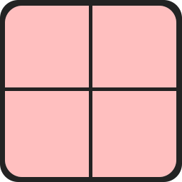
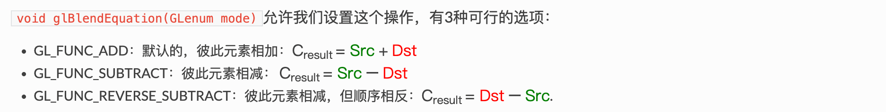

本文继续学习OpenGL的高级技术：混合(Blending)。

## 1. 什么是混合

在计算机图形学中，透明效果是实现逼真场景的重要技术之一。透明物体能够“混合”自身颜色与背后物体的颜色，从而呈现出独特的视觉效果。这种技术在 OpenGL 中被称为 **混合（Blending）**。无论是玻璃窗、烟雾，还是半透明的液体，透明效果的核心都在于如何将不同物体的颜色融合在一起。

### 1.1 透明度：从纯色到混合色

透明物体的视觉特性来源于其颜色的“混合性”。一个有色玻璃窗就是一个典型的例子：它不仅有自己的颜色，还会与背后物体的颜色混合，最终呈现出独特的视觉效果。透明度由颜色的 **alpha 值** 决定，这是颜色向量的第四个分量。当 alpha 值为 1.0 时，物体完全不透明；当 alpha 值为 0.0 时，物体完全透明；而介于两者之间的值则表示半透明。


纹理是实现透明效果的关键工具。除了常见的 RGB（红、绿、蓝）通道外，许多纹理还包含一个 **alpha 通道**，用于定义每个像素的透明度。例如，一个窗户纹理的玻璃部分可能具有较低的 alpha 值（如 0.25），而窗框部分的 alpha 值为 1.0，表示完全不透明。



## 2. 忽略透明像素：实现部分不可见效果

并非所有纹理都需要半透明效果。例如，草叶纹理通常包含完全透明和完全不透明的区域，而没有中间的半透明部分。为了只渲染不透明部分，我们可以利用 OpenGL 的 **discard** 命令丢弃透明像素。

以草叶纹理为例，展示如何忽略透明像素，下面来修改我们之前的代码：

### 2.1 将草纹理显示到场景中

先将草纹理放到工程中显示出来。

#### 2.1.1 加载纹理

之前我们封装的 `loadTexture` 函数其实已经支持加载 RGBA 格式的纹理。`format = GL_RGBA;`。注意这个 `format` 用在了 `glTexImage2D` 函数中。

```cpp
unsigned int loadTexture(char const *path)
{
    unsigned int textureID;
    glGenTextures(1, &textureID);

    int width, height, nrComponents;
    unsigned char *data = stbi_load(path, &width, &height, &nrComponents, 0);
    if (data)
    {
        GLenum format;
        if (nrComponents == 1)
            format = GL_RED;
        else if (nrComponents == 3)
            format = GL_RGB;
        else if (nrComponents == 4)
            format = GL_RGBA;

        glBindTexture(GL_TEXTURE_2D, textureID);
        glTexImage2D(GL_TEXTURE_2D, 0, format, width, height, 0, format, GL_UNSIGNED_BYTE, data);
        glGenerateMipmap(GL_TEXTURE_2D);

        glTexParameteri(GL_TEXTURE_2D, GL_TEXTURE_WRAP_S, GL_REPEAT);
        glTexParameteri(GL_TEXTURE_2D, GL_TEXTURE_WRAP_T, GL_REPEAT);
        glTexParameteri(GL_TEXTURE_2D, GL_TEXTURE_MIN_FILTER, GL_LINEAR_MIPMAP_LINEAR);
        glTexParameteri(GL_TEXTURE_2D, GL_TEXTURE_MAG_FILTER, GL_LINEAR);

        stbi_image_free(data);
    }
    else
    {
        std::cout << "Texture failed to load at path: " << path << std::endl;
        stbi_image_free(data);
    }

    return textureID;
}
```

#### 2.1.2 修改片段着色器

现在加载的纹理包含 alpha 通道，是个 vec4 类型了。所以，需要如下使用纹理：

```glsl
// color = vec4(vec3(texture(texture1, TexCoords)), 1.0);
color = texture(texture1, TexCoords);
```

#### 2.1.3 主程序修改

（1）加载草的纹理

```cpp
unsigned int grassTexture = loadTexture(std::string(PROJECT_PATH + "/resource/grass.png").c_str());
```

（2）设置草的顶点数据

```cpp
float transparentVertices[] = {
    // Positions         // Texture Coords (swapped y coordinates because texture is flipped upside down)
    0.0f,  0.5f,  0.0f,  0.0f,  0.0f,
    0.0f, -0.5f,  0.0f,  0.0f,  1.0f,
    1.0f, -0.5f,  0.0f,  1.0f,  1.0f,

    0.0f,  0.5f,  0.0f,  0.0f,  0.0f,
    1.0f, -0.5f,  0.0f,  1.0f,  1.0f,
    1.0f,  0.5f,  0.0f,  1.0f,  0.0f
};
```


（3）添加草的位置

```cpp
vector<glm::vec3> vegetation;
vegetation.push_back(glm::vec3(-1.5f,  0.0f, -0.48f));
vegetation.push_back(glm::vec3( 1.5f,  0.0f,  0.51f));
vegetation.push_back(glm::vec3( 0.0f,  0.0f,  0.7f));
vegetation.push_back(glm::vec3(-0.3f,  0.0f, -2.3f));
vegetation.push_back(glm::vec3( 0.5f,  0.0f, -0.6f));
```

（4）创建草的VAO、VBO

```cpp
unsigned int transparentVAO, transparentVBO;
glGenVertexArrays(1, &transparentVAO);
glGenBuffers(1, &transparentVBO);
glBindVertexArray(transparentVAO);
glBindBuffer(GL_ARRAY_BUFFER, transparentVBO);
glBufferData(GL_ARRAY_BUFFER, sizeof(transparentVertices), transparentVertices, GL_STATIC_DRAW);
glEnableVertexAttribArray(0);
glVertexAttribPointer(0, 3, GL_FLOAT, GL_FALSE, 5 * sizeof(GLfloat), (GLvoid*)0);
glEnableVertexAttribArray(1);
glVertexAttribPointer(1, 2, GL_FLOAT, GL_FALSE, 5 * sizeof(GLfloat), (GLvoid*)(3 * sizeof(GLfloat)));
glBindVertexArray(0);
```

（5）绘制草

```cpp
glBindVertexArray(transparentVAO);
glBindTexture(GL_TEXTURE_2D, grassTexture);  
for(GLuint i = 0; i < vegetation.size(); i++)
{
    model = glm::mat4();
    model = glm::translate(model, vegetation[i]);
    ourShader.setMat4("model", model);
    glDrawArrays(GL_TRIANGLES, 0, 6);
}  
glBindVertexArray(0);
```

#### 2.1.4 运行效果


### 2.2 忽略透明像素：实现草叶效果

出现上述显示情况是因为OpenGL默认是不知道如何处理alpha值的，不知道何时忽略(丢弃)它们。GLSL为我们提供了discard命令，它保证了片段不会被进一步处理，这样就不会进入颜色缓冲。有了这个命令我们就可以在片段着色器中检查一个片段是否有在一定的阈限下的alpha值，如果有，那么丢弃这个片段。

修改片段着色器如下：

```glsl
void main()
{    
    vec4 texColor = texture(texture1, TexCoords);
    if(texColor.a < 0.1)
        discard;
    color = texColor;
}
```

运行效果：


通过这种方式，我们可以只渲染纹理中不透明的部分，而忽略透明区域，从而实现类似草叶的效果。

细心的朋友可能也发现了，上述运行效果种，草的上方会有一条类似花屏之后的线条。这是因为：

当在纹理边缘进行采样时，OpenGL会在边界值和下一个重复的纹理值之间进行插值，因为我们将其放置方式设置为GL_REPEAT。但由于我们使用的是透明值（alpha值），纹理图片的上部会得到一个与底部纯色值插值后的透明值。这就导致了一个稍微半透明的边缘。

为了避免这种情况，当使用带有alpha通道的纹理时，应该将纹理环绕方式设置为GL_CLAMP_TO_EDGE：

```cpp
glTexParameteri(GL_TEXTURE_2D, GL_TEXTURE_WRAP_S, GL_CLAMP_TO_EDGE);
glTexParameteri(GL_TEXTURE_2D, GL_TEXTURE_WRAP_T, GL_CLAMP_TO_EDGE);
```

这样设置后，纹理在边缘处的采样就不会进行插值，而是会使用边缘的值，从而避免出现半透明的边缘。

修改后运行效果：


## 3. 混合技术：实现半透明效果

上述丢弃片段的方式，不能使我们获得渲染半透明图像，我们要么渲染出像素，要么完全地丢弃它。

如果需要渲染半透明物体（如玻璃窗），则需要启用 OpenGL 的 **混合功能**。混合的核心思想是将当前片段的颜色与颜色缓冲中的颜色按一定规则融合。

### 3.1 混合功能相关接口

启用混合的步骤如下：
1. 启用混合功能：`glEnable(GL_BLEND);`
2. 设置混合方程：`glBlendFunc(GL_SRC_ALPHA, GL_ONE_MINUS_SRC_ALPHA);`

混合方程参数：


混合方程参数的选项：


也可以为RGB和alpha通道各自设置不同的选项，使用`glBlendFuncSeperate`：

```cpp
// 这个方程设置了RGB元素，但是只让最终的alpha元素被源alpha值影响到。
glBlendFuncSeperate(GL_SRC_ALPHA, GL_ONE_MINUS_SRC_ALPHA,GL_ONE, GL_ZERO);
```

还有一个接口，`glBlendEquation`。上面的混合方式都是源和目标元素相加，这个方程可以设置成相减等。



### 3.2 实践：渲染半透明纹理

（1）开启混合

```cpp
glEnable(GL_BLEND);
glBlendFunc(GL_SRC_ALPHA, GL_ONE_MINUS_SRC_ALPHA);
```

（2）修改片段着色器，不用discard

```glsl
void main()
{    
    vec4 texColor = texture(texture1, TexCoords);
    color = texColor;
}
```

（3）加载窗户纹理

```cpp
unsigned int windowTexture = loadTexture(std::string(PROJECT_PATH + "/resource/blending_transparent_window.png").c_str());
```

（4）渲染

这里复用之前草的顶点数据、VAO、VBO和位置数据，只需要在绘制时绑定窗户的纹理即可。

```cpp
glBindTexture(GL_TEXTURE_2D, windowTexture);  
```

运行效果：


上面这个效果可以看到混合了，但是还有点问题。前面的窗子，虽然半透明，但是后面的窗子还是没有完全渲染出来，被前面的窗子遮挡了。

### 3.3 透明物体排序

透明物体的渲染顺序对最终效果至关重要。由于深度缓冲无法正确处理透明像素，透明物体需要按照 **从远到近** 的顺序渲染。否则，由于深度测试的作用，前面的透明物体可能会遮挡后面的物体。

要让混合在多物体上有效，我们必须先绘制最远的物体，最后绘制最近的物体。

实现透明物体排序的步骤如下：
1. 计算每个物体到摄像机的距离。
2. 使用 `std::map` 存储，key为距离，`std::map`会自动按距离从小到大排序。
3. 按排序后的顺序渲染透明物体。

排序代码：

```cpp
std::map<float, glm::vec3> sorted;
for (unsigned int i = 0; i < vegetation.size(); i++) // windows contains all window positions
{
    GLfloat distance = glm::length(cameraPos - vegetation[i]);
    sorted[distance] = vegetation[i];
}
```

然后逆序绘制：

```cpp
for(std::map<float,glm::vec3>::reverse_iterator it = sorted.rbegin(); it != sorted.rend(); ++it)
{
    model = glm::mat4();
    model = glm::translate(model, it->second);
    ourShader.setMat4("model", model);
    glDrawArrays(GL_TRIANGLES, 0, 6);
}  
```

通过这种方式，我们可以确保透明物体的正确显示。运行效果：


> 虽然这个按照它们的距离对物体进行排序的方法在这个特定的场景中能够良好工作，但它**不能进行旋转、缩放或者进行其他的变换，奇怪形状的物体需要一种不同的方式，而不能简单的使用位置向量**。
> 在场景中排序物体是个有难度的技术，它很大程度上取决于你场景的类型，更不必说会耗费额外的处理能力了。完美地渲染带有透明和不透明的物体的场景并不那么容易。有更高级的技术例如次序无关透明度（order independent transparency）。

## 4. 总结

透明与混合是 OpenGL 中实现复杂视觉效果的重要技术。

通过合理设置 alpha 通道、启用混合功能以及对透明物体进行排序，我们能够渲染出逼真的透明效果。

最后，绘制物体的过程可以总结为：

（1）先绘制所有不透明物体

（2）为所有透明物体排序

（3）按顺序绘制透明物体


**篇幅有限，完整程序可私信我（+v：jasper_8017）获取。**