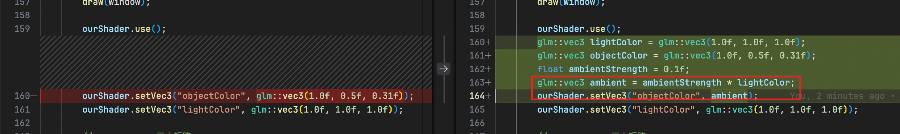
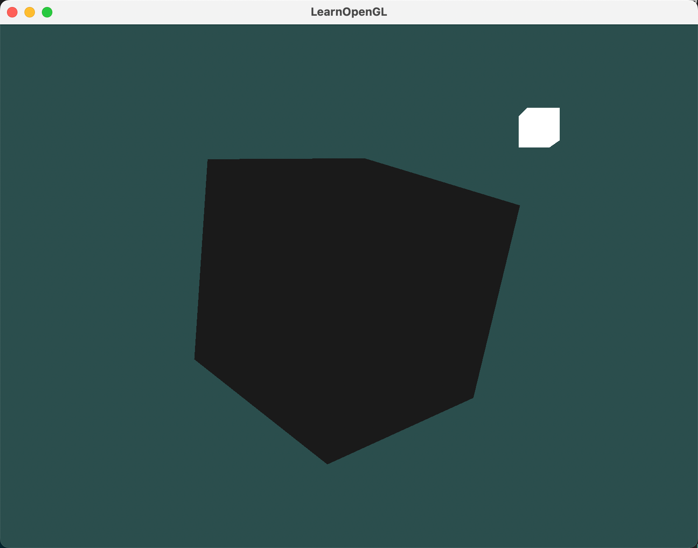
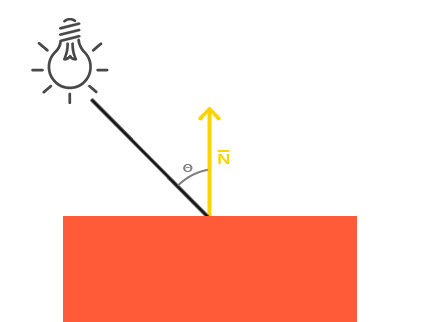
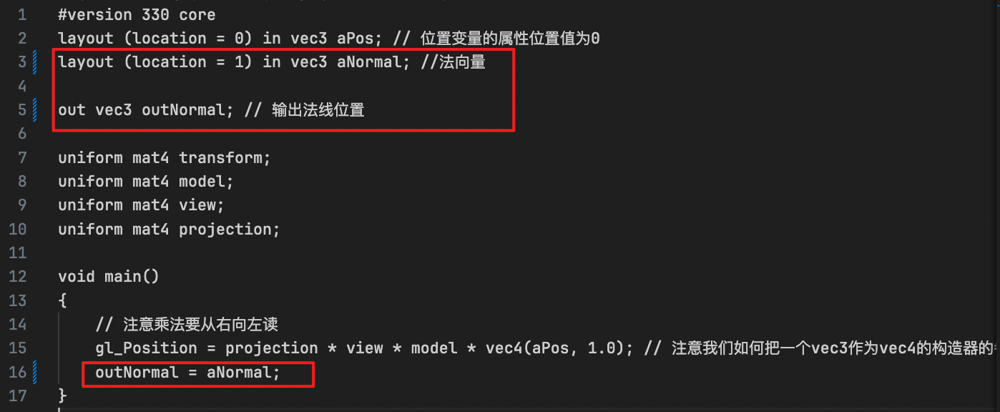
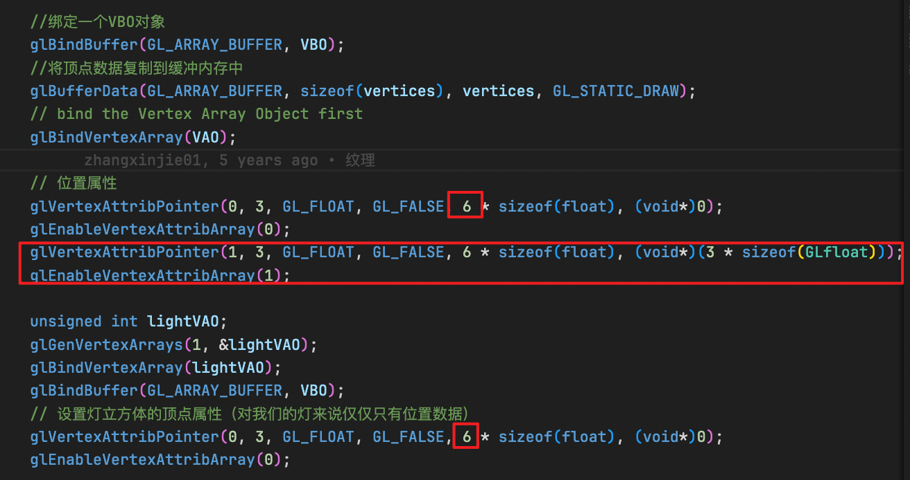
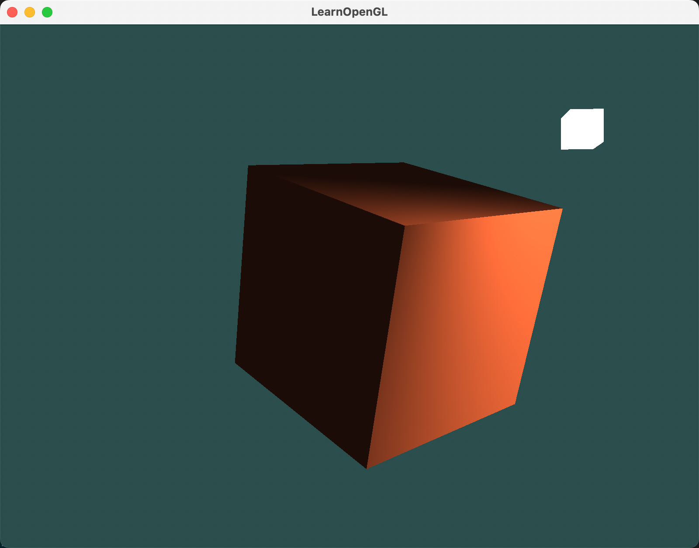
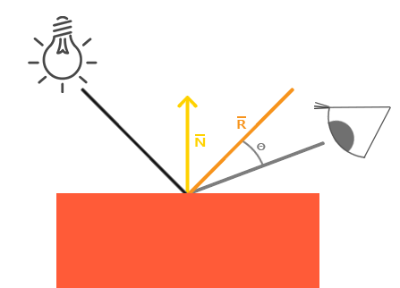
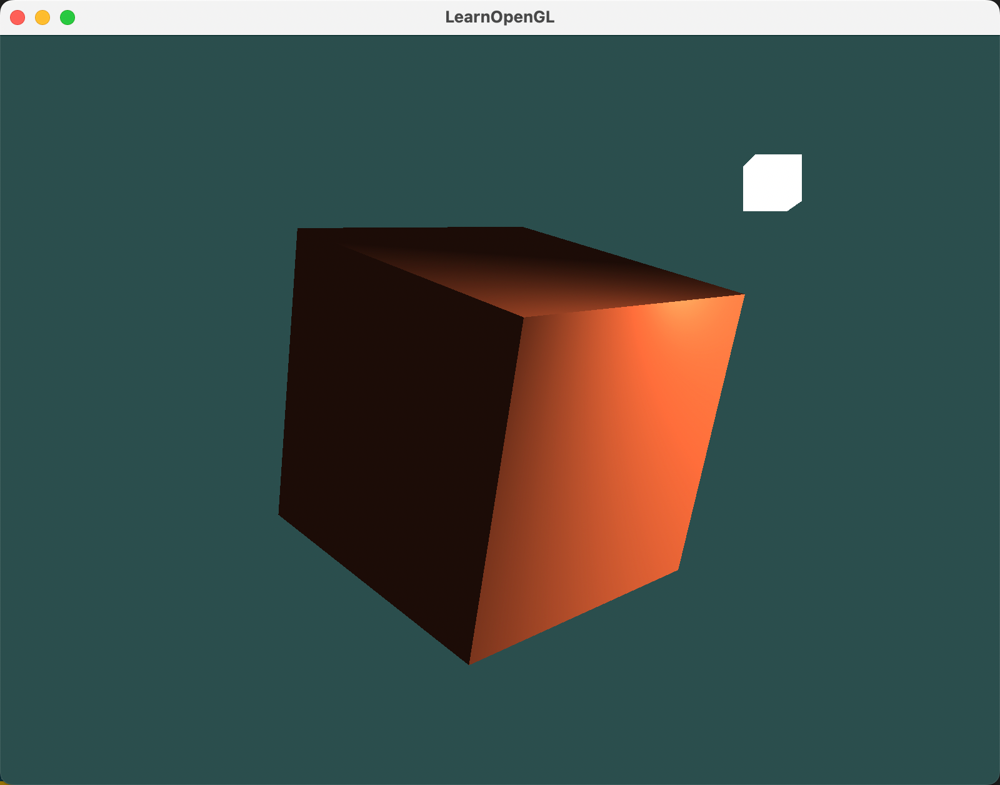
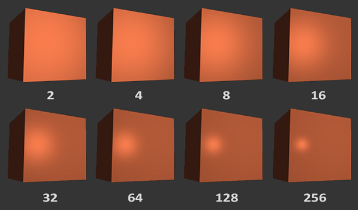

在3D图形的世界里，光照是赋予场景灵魂的关键要素。今天，我们就来深入探讨一下OpenGL中的光照基础，帮助初学者快速上手实操。

## 1. 什么是光照？

光照，简单来说，就是模拟光线在物体表面的反射和折射效果。在现实世界中，光照是极其复杂的，受到诸多因素的影响。但OpenGL通过简化的模型，基于对现实的估计，让我们能够相对容易地模拟出逼真的光照效果。

## 2. 冯氏光照模型

在OpenGL中，常用的光照模型是冯氏光照模型（Phong Lighting Model）。这个模型由三个主要部分组成：环境光照、漫反射光照和镜面光照。

### 2.1 环境光照(Ambient Lighting)

环境光照模拟的是即使在黑暗中，物体也不会完全黑暗的效果。这是因为周围环境总会有一些光线散射到物体上。在OpenGL中，我们可以通过一个很小的常量来模拟这种效果。

```cpp
float ambientStrength = 0.1f;
vec3 ambient = ambientStrength * lightColor;
```



主要是在原来光照基础上，乘上一个很小的环境光照系数。效果如下：




### 2.2 漫反射光照(Diffuse Lighting)

漫反射光照模拟的是物体表面因光线方向不同而产生的明暗变化。面向光源的一面会更亮，而背对光源的一面则会更暗。这需要我们使用法向量（Normal Vector）来计算光线与物体表面的角度。



图左上方有一个光源，它所发出的光线落在物体的一个片段上。我们需要测量这个光线与它所接触片段法线之间的角度。如果光线垂直于物体表面，这束光对物体的影响会最大化。

> 两个单位向量的角度越小，它们点乘的结果越倾向于1。当两个向量的角度是90度的时候，点乘会变为0。角度越大，光对片段颜色的影响越小。


> **注意，我们使用的是单位向量(Unit Vector，长度是1的向量)取得两个向量夹角的余弦值，所以我们需要确保所有的向量都被标准化，否则点乘返回的值就不仅仅是余弦值了**

所以，为了计算漫反射光照，我们现在需要一个法向量，一个光源的方向向量。而光照的方向向量，我们可以通过光源的位置减去片段位置来得到。最终，我们需要知道以下变量：

- 法向量（Normal）
- 光源位置（Light Position）
- 片段位置（Fragment Position）


#### 2.2.1 法向量设置

由于咱们是初学，为了简单起见，直接将法向量写入顶点着色器中。因为是立方体，所以法线很容易知道。

##### 2.2.1.1 顶点数据加入法向量

```cpp
// 立方体顶点
float vertices[] = {
    -0.5f, -0.5f, -0.5f,  0.0f,  0.0f, -1.0f,
    0.5f, -0.5f, -0.5f,  0.0f,  0.0f, -1.0f, 
    0.5f,  0.5f, -0.5f,  0.0f,  0.0f, -1.0f, 
    0.5f,  0.5f, -0.5f,  0.0f,  0.0f, -1.0f, 
    -0.5f,  0.5f, -0.5f,  0.0f,  0.0f, -1.0f, 
    -0.5f, -0.5f, -0.5f,  0.0f,  0.0f, -1.0f, 

    -0.5f, -0.5f,  0.5f,  0.0f,  0.0f, 1.0f,
    0.5f, -0.5f,  0.5f,  0.0f,  0.0f, 1.0f,
    0.5f,  0.5f,  0.5f,  0.0f,  0.0f, 1.0f,
    0.5f,  0.5f,  0.5f,  0.0f,  0.0f, 1.0f,
    -0.5f,  0.5f,  0.5f,  0.0f,  0.0f, 1.0f,
    -0.5f, -0.5f,  0.5f,  0.0f,  0.0f, 1.0f,

    -0.5f,  0.5f,  0.5f, -1.0f,  0.0f,  0.0f,
    -0.5f,  0.5f, -0.5f, -1.0f,  0.0f,  0.0f,
    -0.5f, -0.5f, -0.5f, -1.0f,  0.0f,  0.0f,
    -0.5f, -0.5f, -0.5f, -1.0f,  0.0f,  0.0f,
    -0.5f, -0.5f,  0.5f, -1.0f,  0.0f,  0.0f,
    -0.5f,  0.5f,  0.5f, -1.0f,  0.0f,  0.0f,

    0.5f,  0.5f,  0.5f,  1.0f,  0.0f,  0.0f,
    0.5f,  0.5f, -0.5f,  1.0f,  0.0f,  0.0f,
    0.5f, -0.5f, -0.5f,  1.0f,  0.0f,  0.0f,
    0.5f, -0.5f, -0.5f,  1.0f,  0.0f,  0.0f,
    0.5f, -0.5f,  0.5f,  1.0f,  0.0f,  0.0f,
    0.5f,  0.5f,  0.5f,  1.0f,  0.0f,  0.0f,

    -0.5f, -0.5f, -0.5f,  0.0f, -1.0f,  0.0f,
    0.5f, -0.5f, -0.5f,  0.0f, -1.0f,  0.0f,
    0.5f, -0.5f,  0.5f,  0.0f, -1.0f,  0.0f,
    0.5f, -0.5f,  0.5f,  0.0f, -1.0f,  0.0f,
    -0.5f, -0.5f,  0.5f,  0.0f, -1.0f,  0.0f,
    -0.5f, -0.5f, -0.5f,  0.0f, -1.0f,  0.0f,

    -0.5f,  0.5f, -0.5f,  0.0f,  1.0f,  0.0f,
    0.5f,  0.5f, -0.5f,  0.0f,  1.0f,  0.0f,
    0.5f,  0.5f,  0.5f,  0.0f,  1.0f,  0.0f,
    0.5f,  0.5f,  0.5f,  0.0f,  1.0f,  0.0f,
    -0.5f,  0.5f,  0.5f,  0.0f,  1.0f,  0.0f,
    -0.5f,  0.5f, -0.5f,  0.0f,  1.0f,  0.0f
};
```

##### 2.2.1.2 修改顶点着色器

往顶点数组中加了新的数据，同时需要修改顶点着色器，让它能够读取法向量。另外，**所有光照的计算需要在片段着色器里进行**，所以我们需要把法向量由顶点着色器传递到片段着色器。


```glsl
#version 330 core
layout (location = 0) in vec3 aPos; // 位置变量的属性位置值为0
layout (location = 1) in vec3 aNormal; //法向量
out vec3 outNormal; // 输出法线位置

uniform mat4 transform;
uniform mat4 model;
uniform mat4 view;
uniform mat4 projection;

void main()
{
    // 注意乘法要从右向左读
    gl_Position = projection * view * model * vec4(aPos, 1.0); // 注意我们如何把一个vec3作为vec4的构造器的参数
    outNormal = aNormal;
}
```



##### 2.2.1.3 修改顶点属性指针

还需要修改顶点属性指针：

```cpp
glVertexAttribPointer(0, 3, GL_FLOAT, GL_FALSE, 6 * sizeof(float), (void*)0);
glEnableVertexAttribArray(0);
glVertexAttribPointer(1, 3, GL_FLOAT, GL_FALSE, 6 * sizeof(float), (void*)(3 * sizeof(GLfloat)));
glEnableVertexAttribArray(1);
```



> **光源立方体并不需要法线数据，但是由于其与物体立方体使用的是同一个VBO，所以，法线数据也放在GPU里了。这样看起来有点浪费，其实不然，相对于重新给发光物分配VBO，实际上是更高效了。**


##### 2.2.1.4 修改片段着色器

顶点着色器将法线数据传了过来，片段着色器要接收。

```glsl
in vec3 outNormal;
```

#### 2.2.2 光源位置设置

接下来，将光源位置设置到片段着色器中：

```glsl
uniform vec3 lightPos;
```

在cpp程序中，将光源位置设置进来：

```cpp
ourShader.setVec3("lightPos", lightPos);
```


#### 2.2.3 片段位置设置

我们会在 **世界空间** 中进行所有的光照计算，因此我们需要一个在世界空间中的顶点位置。我们可以通过把顶点位置属性乘以模型矩阵(Model Matrix, 只用模型矩阵不需要用观察和投影矩阵) 来把它变换到世界空间坐标。这个在顶点着色器中很容易完成，所以让我们就声明一个输出(out)变量，然后计算它的世界空间坐标。

##### 2.2.3.1 修改顶点着色器

计算并输出片段位置。

```glsl
......
out vec3 FragPos;
......

void main()
{
    ......
    outFragPos = vec3(model * vec4(aPos, 1.0));
}
```

##### 2.2.3.2 修改片段着色器

接收片段位置。

```glsl
in vec3 FragPos;
```

#### 2.2.4 计算漫反射光照

在片段着色器中计算最终的颜色。

（1）计算光源和片段位置之间的方向向量

```glsl
vec3 norm = normalize(Normal);
vec3 lightDir = normalize(lightPos - FragPos);
```

（2）计算光照强度系数（两向量点积）

```glsl
float diff = max(dot(lightDir, normal), 0.0);
```

（3）漫反射颜色计算

漫反射颜色为以上影响系数乘以光源颜色。

```glsl
vec3 diffuse = diff * lightColor;
```

（4）结合环境光

```glsl
vec3 finalColor = diffuse * objectColor + lightColor * objectColor;
FragColor = vec4(finalColor, 1.0);
```

最终完整的片段着色器代码如下：

```glsl
#version 330 core
out vec4 FragColor;

in vec3 outNormal;
in vec3 outFragPos;
uniform vec3 lightPos;

uniform vec3 objectColor;
uniform vec3 lightColor;

void main()
{
    // 环境光
    float ambientStrength = 0.1f;
    vec3 ambient = ambientStrength * lightColor;

    // 漫反射光
    vec3 lightDir = normalize(lightPos - outFragPos);
    vec3 normal = normalize(outNormal);
    float diff = max(dot(lightDir, normal), 0.0);
    vec3 diffuse = diff * lightColor;

    vec3 finalColor = diffuse * objectColor + ambient * objectColor;

    FragColor = vec4(finalColor, 1.0);
}
```

#### 2.2.5 运行结果



> **确保所有相关向量最后都转换为单位向量**！

### 2.3 镜面光照(Specular Lighting)



镜面光照同样依赖光的方向向量和物体的法向量，但是它还会依赖观察方向，例如玩家是从什么方向看着这个片段的。

#### 2.3.1 观察方向计算

##### 2.3.1.1 观察者坐标

我们简单地使用摄像机对象的位置坐标代替(它就是观察者)。

在片段着色器中添加观察者坐标。

```glsl
uniform vec3 viewPos;
```

在cpp程序中，将观察者坐标设置进来：

```cpp
ourShader.setVec3("viewPos", camera.m_position);
```

##### 2.3.1.2 计算镜面光照

（1）观察方向是从片段位置到摄像机位置的向量。

```glsl
vec3 viewDir = normalize(viewPos - outFragPos);
```

（2）反射方向计算：

```glsl
vec3 reflectDir = reflect(-lightDir, outNormal);
```

reflect函数要求的第一个参数是从光源指向片段位置的向量，第二个参数是法线向量。因为lightDir是片段到光源的向量，所以这里使用了负号。

（3）计算镜面光照强度

首先，需要提供一个镜面强度(Specular Intensity)，让高光的影响不会太大。这里先简单指定为0.5。然后还有一个值，叫做光泽度(Shininess)，它决定了高光的大小。这里先简单指定为32（注意这个值的用法，指数计算pow）。

```glsl
float specularStrength = 0.5f;

float diff_spec = max(dot(viewDir, reflectDir), 0.0);
float spec = pow(diff_spec, 32);
vec3 specular = specularStrength * spec * lightColor;

```

（4）结合环境光和漫反射

```glsl
vec3 finalColor = diffuse(ambient * objectColor + ambientdiffuse * objectColor + specular) * objectColor;
```



一个物体的发光值越高，反射光的能力越强，散射得越少，高光点越小。在下面的图片里，你会看到不同发光值对视觉(效果)的影响：




```cpp
vec3 norm = normalize(Normal);
vec3 lightDir = normalize(lightPos - FragPos);
float diff = max(dot(norm, lightDir), 0.0);
vec3 diffuse = diff * lightColor;
```


## 3. 注意事项

（1）法向量的处理：在进行光照计算时，法向量需要转换到世界空间坐标。如果模型矩阵包含不等比缩放，需要使用**正规矩阵（Normal Matrix）**来处理法向量。

（2）光照计算的空间：虽然在世界空间中进行光照计算更直观，但也可以选择在观察空间中进行，这需要将观察矩阵应用到相关向量上。

（3）性能优化：在着色器中使用逆矩阵和转置矩阵会增加计算开销，对于性能要求较高的应用，可以在CPU端预先计算正规矩阵，并通过uniform传递给着色器。
