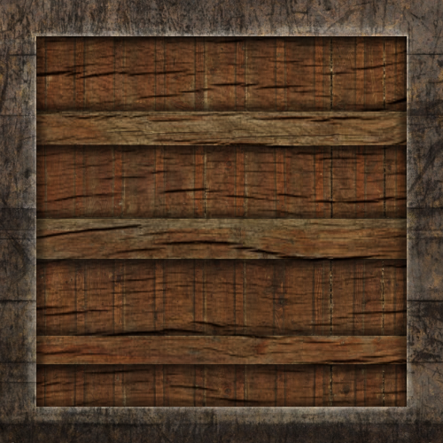
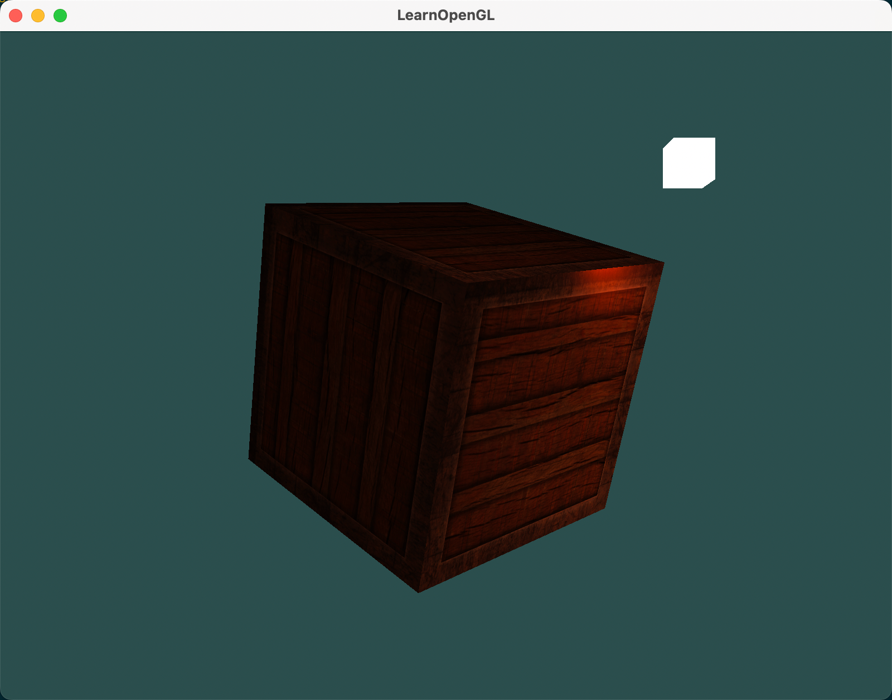
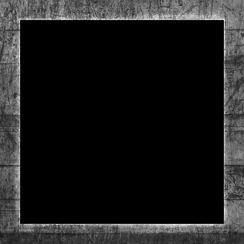
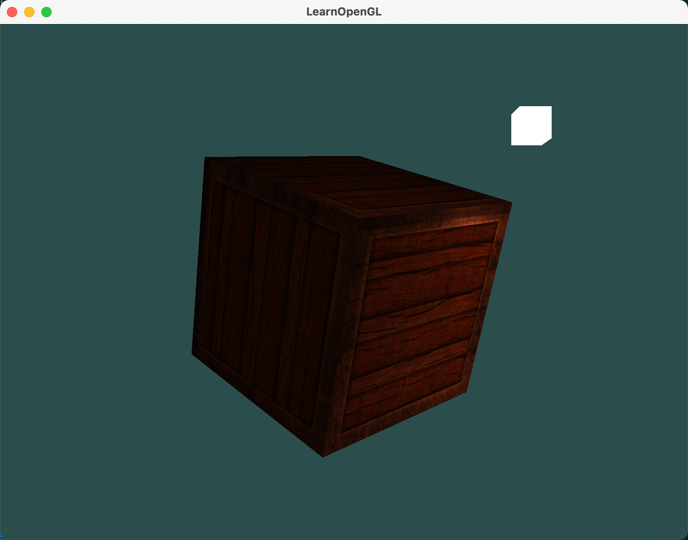

👀 看过来！今天教你再进一步，让D物体更更更真实。今天咱们来聊一聊 OpenGL 中的光照贴图！

## 1. 为啥要搞光照贴图？

前面我们学给物体加材质，让不同物体对光照有不同反应。但问题是，现实中的物体一个比一个复杂，光靠之前那种给整个物体一个统一材质的方法，根本不够看。像一辆车，车外壳贼亮，轮胎没啥高光，轮毂又特别闪。要是还用之前那套，整个车的材质都一样，那看起来得多假？
所以，光照贴图就来了！它能让你对物体的漫反射（diffuse）和镜面反射（specular）成分进行更精确的控制。

## 2. 漫反射贴图（Diffuse texture）

漫反射贴图其实就是给物体贴一张 "纹理"，让每个像素点的漫反射颜色都不一样。

下面我们将用下面的图，贴到箱子上，来实战一下。



### 2.1 修改片段着色器

原来的片段着色器材质属性：

```glsl
struct Material {
    vec3 ambient;
    vec3 diffuse;
    vec3 specular;
    float shininess;
};
```

可以看到，漫反射属性diffuse是一个固定值，在物体上的每一点都是同一个颜色。现在，我们要将漫反射属性改成纹理属性：

```glsl
struct Material {
    sampler2D diffuse;
    vec3 specular;
    float shininess;
};
```

然后加一个变量接收纹理坐标：

```glsl
in vec2 TexCoords;
```

> 上面我们还将 ambient属性 给删除了。因为ambient颜色绝大多数情况等于diffuse颜色，所以不需要分别去储存它。（先记住这个结论吧，至于为什么二者相等，后面再说）

有了纹理，我们继续修改漫反射最终颜色的计算：

```glsl
vec3 diffuse = vec3(texture(material.diffuse, TexCoords)) * diff * light.diffuse;
```

同时，因为我们删除了 ambient 属性，所以ambient的计算也要用纹理来计算：

```glsl
vec3 ambient = vec3(texture(material.diffuse, TexCoords)) * light.ambient;
```

### 2.2 修改顶点着色器

顶点着色器需要将纹理坐标传给片段着色器：

```glsl
......
layout (location = 2) in vec2 texCoords;
out vec2 TexCoords;

......
TexCoords = texCoords;
```

### 2.3 纹理赋值

在主程序中，将纹理设置给着色器：

（1）首先修改顶点数组

因为我们新增了纹理坐标，所以需要修改顶点数组：

```cpp
// Positions          // Normals           // Texture Coords
-0.5f, -0.5f, -0.5f,  0.0f,  0.0f, -1.0f,  0.0f,  0.0f,
0.5f, -0.5f, -0.5f,  0.0f,  0.0f, -1.0f,  1.0f,  0.0f,
0.5f,  0.5f, -0.5f,  0.0f,  0.0f, -1.0f,  1.0f,  1.0f,
0.5f,  0.5f, -0.5f,  0.0f,  0.0f, -1.0f,  1.0f,  1.0f,
-0.5f,  0.5f, -0.5f,  0.0f,  0.0f, -1.0f,  0.0f,  1.0f,
-0.5f, -0.5f, -0.5f,  0.0f,  0.0f, -1.0f,  0.0f,  0.0f,

-0.5f, -0.5f,  0.5f,  0.0f,  0.0f,  1.0f,  0.0f,  0.0f,
0.5f, -0.5f,  0.5f,  0.0f,  0.0f,  1.0f,  1.0f,  0.0f,
0.5f,  0.5f,  0.5f,  0.0f,  0.0f,  1.0f,  1.0f,  1.0f,
0.5f,  0.5f,  0.5f,  0.0f,  0.0f,  1.0f,  1.0f,  1.0f,
-0.5f,  0.5f,  0.5f,  0.0f,  0.0f,  1.0f,  0.0f,  1.0f,
-0.5f, -0.5f,  0.5f,  0.0f,  0.0f,  1.0f,  0.0f,  0.0f,

-0.5f,  0.5f,  0.5f, -1.0f,  0.0f,  0.0f,  1.0f,  0.0f,
-0.5f,  0.5f, -0.5f, -1.0f,  0.0f,  0.0f,  1.0f,  1.0f,
-0.5f, -0.5f, -0.5f, -1.0f,  0.0f,  0.0f,  0.0f,  1.0f,
-0.5f, -0.5f, -0.5f, -1.0f,  0.0f,  0.0f,  0.0f,  1.0f,
-0.5f, -0.5f,  0.5f, -1.0f,  0.0f,  0.0f,  0.0f,  0.0f,
-0.5f,  0.5f,  0.5f, -1.0f,  0.0f,  0.0f,  1.0f,  0.0f,

0.5f,  0.5f,  0.5f,  1.0f,  0.0f,  0.0f,  1.0f,  0.0f,
0.5f,  0.5f, -0.5f,  1.0f,  0.0f,  0.0f,  1.0f,  1.0f,
0.5f, -0.5f, -0.5f,  1.0f,  0.0f,  0.0f,  0.0f,  1.0f,
0.5f, -0.5f, -0.5f,  1.0f,  0.0f,  0.0f,  0.0f,  1.0f,
0.5f, -0.5f,  0.5f,  1.0f,  0.0f,  0.0f,  0.0f,  0.0f,
0.5f,  0.5f,  0.5f,  1.0f,  0.0f,  0.0f,  1.0f,  0.0f,

-0.5f, -0.5f, -0.5f,  0.0f, -1.0f,  0.0f,  0.0f,  1.0f,
0.5f, -0.5f, -0.5f,  0.0f, -1.0f,  0.0f,  1.0f,  1.0f,
0.5f, -0.5f,  0.5f,  0.0f, -1.0f,  0.0f,  1.0f,  0.0f,
0.5f, -0.5f,  0.5f,  0.0f, -1.0f,  0.0f,  1.0f,  0.0f,
-0.5f, -0.5f,  0.5f,  0.0f, -1.0f,  0.0f,  0.0f,  0.0f,
-0.5f, -0.5f, -0.5f,  0.0f, -1.0f,  0.0f,  0.0f,  1.0f,

-0.5f,  0.5f, -0.5f,  0.0f,  1.0f,  0.0f,  0.0f,  1.0f,
0.5f,  0.5f, -0.5f,  0.0f,  1.0f,  0.0f,  1.0f,  1.0f,
0.5f,  0.5f,  0.5f,  0.0f,  1.0f,  0.0f,  1.0f,  0.0f,
0.5f,  0.5f,  0.5f,  0.0f,  1.0f,  0.0f,  1.0f,  0.0f,
-0.5f,  0.5f,  0.5f,  0.0f,  1.0f,  0.0f,  0.0f,  0.0f,
-0.5f,  0.5f, -0.5f,  0.0f,  1.0f,  0.0f,  0.0f,  1.0f
```

（2）修改顶点属性绑定

顶点数组变化了，紧接着要记得修改对应的顶点属性绑定：

```cpp
glVertexAttribPointer(0, 3, GL_FLOAT, GL_FALSE, 8 * sizeof(float), (void*)0);
glEnableVertexAttribArray(0);
glVertexAttribPointer(1, 3, GL_FLOAT, GL_FALSE, 8 * sizeof(float), (void*)(3 * sizeof(GLfloat)));
glEnableVertexAttribArray(1);
glVertexAttribPointer(2, 2, GL_FLOAT, GL_FALSE, 8 * sizeof(float), (void*)(6 * sizeof(GLfloat)));
glEnableVertexAttribArray(2);
```

（3）加载纹理

复习一下加载纹理的步骤：

- 创建纹理ID: glGenTextures
- 绑定纹理: glBindTexture
- 配置纹理参数: glTexParameteri
- 加载纹理图片: stbi_load
- 生成纹理: glTexImage2D
- 解除绑定: glBindTexture

```cpp
unsigned int diffuseMap;
glGenTextures(1, &diffuseMap);
int width, height, nrChannels;
std::string filePath = PROJECT_PATH + "/resource/container2.png";
unsigned char *data = stbi_load(filePath.c_str(), &width, &height, &nrChannels, 0);
glBindTexture(GL_TEXTURE_2D, diffuseMap);
glTexImage2D(GL_TEXTURE_2D, 0, GL_RGB, width, height, 0, GL_RGB, GL_UNSIGNED_BYTE, data);
glGenerateMipmap(GL_TEXTURE_2D);
stbi_image_free(data);
glTexParameteri(GL_TEXTURE_2D, GL_TEXTURE_WRAP_S, GL_REPEAT);   
glTexParameteri(GL_TEXTURE_2D, GL_TEXTURE_WRAP_T, GL_REPEAT);
glTexParameteri(GL_TEXTURE_2D, GL_TEXTURE_MIN_FILTER, GL_LINEAR);
glTexParameteri(GL_TEXTURE_2D, GL_TEXTURE_MAG_FILTER, GL_LINEAR);
glBindTexture(GL_TEXTURE_2D, 0);
```

（4）将纹理传递给着色器

```cpp
ourShader.use();
ourShader.setInt("material.diffuse", 0);
```

（5）每次渲染时，激活纹理单元并绑定纹理：

```cpp
glActiveTexture(GL_TEXTURE0);
glBindTexture(GL_TEXTURE_2D, diffuseMap);
```

### 2.4 运行效果



## 3. 镜面贴图: 让物体有的地方贼亮，有的地方不亮

镜面贴图能让你控制物体哪些地方有镜面高光，哪些地方没有。比如这个木箱子，木头部分没啥高光，但钢边得有高光。这时候镜面贴图就派上用场了。

镜面贴图一般是黑白的，黑色代表没高光，白色代表有高光。你也可以用其他颜色，不过一般情况下，高光颜色主要还是看光源颜色，所以黑白的就够用了。例如下面的这张图就最为镜面贴图来用：



> 使用Photoshop或Gimp之类的工具，通过将图片进行裁剪，将某部分调整成黑白图样，并调整亮度/对比度的做法，可以非常容易将一个diffuse纹理贴图处理为specular贴图。

在代码里，镜面贴图的用法和漫反射贴图差不多。

### 3.1 修改片段着色器

（1）修改材质属性，将 specular 属性改为纹理类型

```glsl
struct Material {
    sampler2D diffuse;
    sampler2D specular;
    float shininess;
};
```

（2）修改specular光照的计算：

```glsl
vec3 specular = vec3(texture(material.specular, TexCoords)) * spec * light.specular;
```


### 3.2 修改顶点着色器

纹理坐标使用同一个，所以顶点着色器这里不用修改。

### 3.3 修改纹理赋值

（1）纹理坐标可以直接用diffuse纹理坐标，所以顶点数组不用动，顶点属性绑定也不用动。

（2）加载纹理

```cpp
unsigned int specularMap;
glGenTextures(1, &specularMap);
int width, height, nrChannels;
std::string filePath = PROJECT_PATH + "/resource/container2_border.png";
unsigned char *data = stbi_load(filePath.c_str(), &width, &height, &nrChannels, 0);
glBindTexture(GL_TEXTURE_2D, specularMap);
glTexImage2D(GL_TEXTURE_2D, 0, GL_RGB, width, height, 0, GL_RGB, GL_UNSIGNED_BYTE, data);
glGenerateMipmap(GL_TEXTURE_2D);
stbi_image_free(data);
glTexParameteri(GL_TEXTURE_2D, GL_TEXTURE_WRAP_S, GL_REPEAT);   
glTexParameteri(GL_TEXTURE_2D, GL_TEXTURE_WRAP_T, GL_REPEAT);
glTexParameteri(GL_TEXTURE_2D, GL_TEXTURE_MIN_FILTER, GL_LINEAR);
glTexParameteri(GL_TEXTURE_2D, GL_TEXTURE_MAG_FILTER, GL_LINEAR);
glBindTexture(GL_TEXTURE_2D, 0);
```

（3）将纹理传递给着色器

```cpp
ourShader.setInt("material.specular", 1);
```

（4）每次渲染时，激活纹理单元并绑定纹理：

```cpp
glActiveTexture(GL_TEXTURE1);
glBindTexture(GL_TEXTURE_2D, specularMap);
```

### 3.4 运行效果



## 4. 总结

漫反射贴图让物体颜色丰富起来，镜面贴图则让物体的高光细节更逼真。光照贴图只是纹理贴图的一种，还有法线贴图、凹凸贴图、反射贴图等等，可以给物体添加更多细节。


