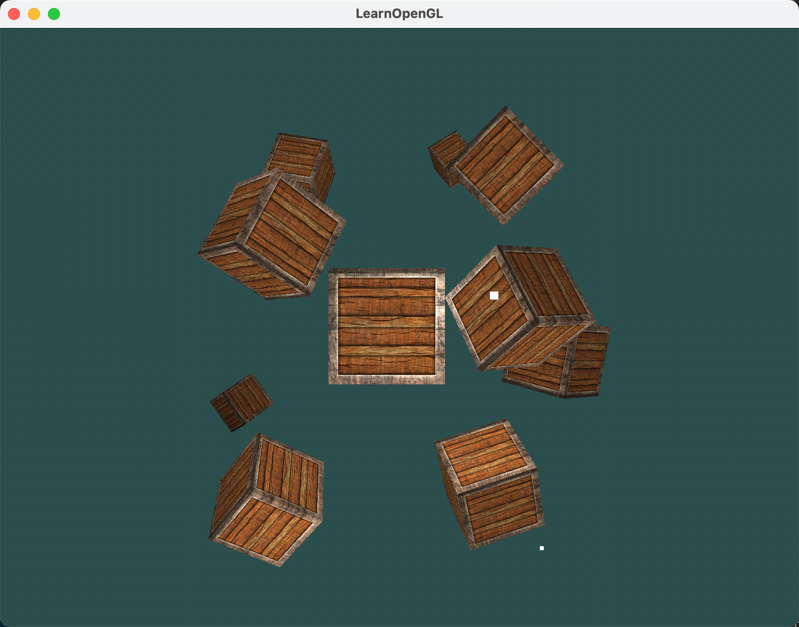

前面几个教程，我们已经学习了许多关于 OpenGL 光照的知识，其中包括冯氏照明模型（Phong shading）、光照材质（Materials）、光照贴图（Lighting maps）以及各种投光物（Light casters）。本教程将结合上述所学的知识，创建一个包含六个光源的场景。我们将模拟一个类似阳光的平行光（Directional light）和4个定点光（Point lights）以及一个手电筒(Flashlight)。


## 1. 多光源框架优化

为了在场景中高效运用多光源，我们需要在 GLSL 中巧妙封装一些函数，用于计算不同光源的光照效果。若为每个光源单独编写光照计算代码，不仅繁琐不堪，还会使 main 函数变得混乱不堪。因此，将相关操作封装为函数是更为明智的选择。

在处理多光源场景时，通常采用以下方法：创建一个用于存储输出颜色的向量，每个光源对输出颜色贡献相应的色彩份额。因此，场景中的每个光源将独立运算，其结果共同影响最终的输出颜色。以下是实现这一目标的通用结构：

```glsl
out vec4 color;

void main()
{
    // 定义输出颜色
    vec3 output;
    // 将平行光的运算结果颜色添加到输出颜色
    output += someFunctionToCalculateDirectionalLight();
    // 同样，将定点光的运算结果颜色添加到输出颜色
    for(int i = 0; i < nr_of_point_lights; i++)
        output += someFunctionToCalculatePointLight();
    // 添加其他光源的计算结果颜色（如投射光）
    output += someFunctionToCalculateSpotLight();

    color = vec4(output, 1.0);
}
```

可以看到，我们为每种光源类型创建了一个函数：

- 平行光：someFunctionToCalculateDirectionalLight()
- 点光源：someFunctionToCalculatePointLight()
- 聚光：someFunctionToCalculateSpotLight()

下面我们分别实现三个函数。


## 2. 平行光（Directional Light）封装

### 2.1 平行光结构体

首先，定义平行光的结构体，并定义 uniform 变量来传递平行光的数据。

```glsl
struct DirLight {
    vec3 direction;

    vec3 ambient;
    vec3 diffuse;
    vec3 specular;
};  
uniform DirLight dirLight;
```

### 2.2 平行光计算函数

我们将平行光计算函数命名为 `calculateDirectionalLight`。其需要的参数包括：

- 方向光（DirLight）
- 法线（Normal）
- 视角（View Direction）

所以，函数声明如下：

```glsl
vec3 calculateDirectionalLight(DirLight light, vec3 normal, vec3 viewDir);
```

接下来，我们实现该函数（将之前平行光计算的代码复制过来）。

```glsl
vec3 calculateDirectionalLight(DirLight light, vec3 normal, vec3 viewDir)
{
    vec3 lightDir = normalize(-light.direction);
    // 计算漫反射强度
    float diff = max(dot(normal, lightDir), 0.0);
    // 计算镜面反射强度
    vec3 reflectDir = reflect(-lightDir, normal);
    float spec = pow(max(dot(viewDir, reflectDir), 0.0), material.shininess);
    // 合并各个光照分量
    vec3 ambient  = light.ambient  * vec3(texture(material.diffuse, TexCoords));
    vec3 diffuse  = light.diffuse  * diff * vec3(texture(material.diffuse, TexCoords));
    vec3 specular = light.specular * spec * vec3(texture(material.specular, TexCoords));
    return (ambient + diffuse + specular);
}  
```

## 3. 点光源（Point Light）封装

### 3.1 点光源结构体

首先，定义点光源的结构体，并定义 uniform 变量来传递点光源的数据。

```glsl
struct PointLight {
    vec3 position;

    float constant;
    float linear;
    float quadratic;

    vec3 ambient;
    vec3 diffuse;
    vec3 specular;
};
#define NR_POINT_LIGHTS 4  
uniform PointLight pointLights[NR_POINT_LIGHTS];
```

### 3.2 点光源计算函数

我们将点光源计算函数命名为 `calculatePointLight`。其需要的参数包括：

- 点光源（PointLight）
- 法线（Normal）
- 视角（View Direction）
- 片段位置（Fragment Position）

所以，函数声明如下：

```glsl
vec3 calculatePointLight(PointLight light, vec3 normal, vec3 viewDir, vec3 fragPos);
```

接下来，我们实现该函数（将之前点光源计算的代码复制过来）。

```glsl
vec3 calculatePointLight(PointLight light, vec3 normal, vec3 viewDir, vec3 fragPos)
{
    vec3 lightDir = normalize(light.position - fragPos);
    // 计算漫反射强度
    float diff = max(dot(normal, lightDir), 0.0);
    // 计算镜面反射
    vec3 reflectDir = reflect(-lightDir, normal);
    float spec = pow(max(dot(viewDir, reflectDir), 0.0), material.shininess);
    // 计算衰减
    float distance = length(light.position - fragPos);
    float attenuation = 1.0f / (light.constant + light.linear * distance + light.quadratic * (distance * distance));
    // 将各个分量合并
    vec3 ambient  = light.ambient  * vec3(texture(material.diffuse, TexCoords));
    vec3 diffuse  = light.diffuse  * diff * vec3(texture(material.diffuse, TexCoords));
    vec3 specular = light.specular * spec * vec3(texture(material.specular, TexCoords));
    ambient  *= attenuation;
    diffuse  *= attenuation;
    specular *= attenuation;
    return (ambient + diffuse + specular);
}
```

## 4. 聚光灯（Spot Light）封装

### 4.1 聚光灯结构体

首先，定义聚光灯的结构体，并定义 uniform 变量来传递聚光灯的数据。

```glsl
struct SpotLight {
    vec3 position;
    vec3 direction;
    float cutOff;
    float outerCutOff;

    float constant;
    float linear;
    float quadratic;

    vec3 ambient;
    vec3 diffuse;
    vec3 specular;
};
uniform SpotLight spotLight;
```

### 4.2 聚光灯计算函数

我们将聚光灯计算函数命名为 `calculateSpotLight`。其需要的参数包括：

- 聚光灯（SpotLight）
- 法线（Normal）
- 视角（View Direction）
- 片段位置（Fragment Position）

所以，函数声明如下：

```glsl
vec3 calculateSpotLight(SpotLight light, vec3 normal, vec3 viewDir, vec3 fragPos);
```

接下来，我们实现该函数（将之前聚光灯计算的代码复制过来）。

```glsl
vec3 calculateSpotLight(SpotLight light, vec3 normal, vec3 viewDir, vec3 fragPos)
{
    // 环境光
    vec3 ambient = vec3(texture(material.diffuse, TexCoords)) * light.ambient;
    vec3 lightDir = normalize(light.position - fragPos);

    float theta = dot(lightDir, -light.direction);
    float epsilon = light.cutOff - light.outerCutOff;
    float intensity = clamp((theta - light.outerCutOff) / epsilon, 0.0, 1.0);

    // 漫反射光
    float diff = max(dot(lightDir, normal), 0.0);
    vec3 diffuse = vec3(texture(material.diffuse, TexCoords)) * diff * light.diffuse;

    // 镜面光
    vec3 reflectDir = reflect(-lightDir, normal);
    float diff_spec = max(dot(viewDir, reflectDir), 0.0);
    float spec = pow(diff_spec, material.shininess);
    vec3 specular = vec3(texture(material.specular, TexCoords)) * spec * light.specular;

    // 衰减
    float distance = length(light.position - fragPos);
    float attenuation = 1.0f / (light.constant + light.linear * distance + light.quadratic * (distance * distance));

    vec3 finalColor = ambient + (diffuse + specular) * attenuation * intensity;
    return finalColor;
}
```

## 5. 整合光照计算

在 `main` 函数中，整合点光源和聚光灯的计算。

```glsl
vec3 normal = normalize(outNormal);
vec3 viewDir = normalize(viewPos - outFragPos);

// 将平行光的运算结果颜色添加到输出颜色
vec3 finalColor = calculateDirectionalLight(dirLight, normal, viewDir);
// 同样，将定点光的运算结果颜色添加到输出颜色
for(int i = 0; i < NR_POINT_LIGHTS; i++)
{
    finalColor += calculatePointLight(pointLights[i], normal, viewDir, outFragPos);
}
// 添加其他光源的计算结果颜色（如投射光）
finalColor += calculateSpotLight(spotLight, normal, viewDir, outFragPos);

FragColor = vec4(finalColor, 1.0);
```

## 6. 主程序中设置光源数据

（1）先定义四个点光源

```cpp
glm::vec3 pointLightPositions[] = {
    glm::vec3( 0.7f,  0.2f,  2.0f),
    glm::vec3( 2.3f, -3.3f, -4.0f),
    glm::vec3(-4.0f,  2.0f, -12.0f),
    glm::vec3( 0.0f,  0.0f, -3.0f)
};  
```

（2）光源参数设置

```cpp
// 平行光光源
ourShader.setVec3("dirLight.direction", lightDir);
ourShader.setVec3("dirLight.ambient", glm::vec3(0.2f, 0.2f, 0.2f) * lightColor);
ourShader.setVec3("dirLight.diffuse", glm::vec3(0.5f, 0.5f, 0.5f) * lightColor);
ourShader.setVec3("dirLight.specular", glm::vec3(1.0f, 1.0f, 1.0f));

// 点光源
ourShader.setVec3("pointLights[0].ambient", glm::vec3(0.2f, 0.2f, 0.2f) * lightColor);
ourShader.setVec3("pointLights[0].diffuse", glm::vec3(0.5f, 0.5f, 0.5f) * lightColor);
ourShader.setVec3("pointLights[0].specular", glm::vec3(1.0f, 1.0f, 1.0f));
ourShader.setFloat("pointLights[0].constant", 1.0f);
ourShader.setFloat("pointLights[0].linear", 0.09f);
ourShader.setFloat("pointLights[0].quadratic", 0.032f);
ourShader.setVec3("pointLights[0].position", pointLightPositions[0]);

ourShader.setVec3("pointLights[1].ambient", glm::vec3(0.2f, 0.2f, 0.2f) * lightColor);
ourShader.setVec3("pointLights[1].diffuse", glm::vec3(0.5f, 0.5f, 0.5f) * lightColor);
ourShader.setVec3("pointLights[1].specular", glm::vec3(1.0f, 1.0f, 1.0f));
ourShader.setFloat("pointLights[1].constant", 1.0f);
ourShader.setFloat("pointLights[1].linear", 0.09f);
ourShader.setFloat("pointLights[1].quadratic", 0.032f);
ourShader.setVec3("pointLights[1].position", pointLightPositions[1]);

ourShader.setVec3("pointLights[2].ambient", glm::vec3(0.2f, 0.2f, 0.2f) * lightColor);
ourShader.setVec3("pointLights[2].diffuse", glm::vec3(0.5f, 0.5f, 0.5f) * lightColor);
ourShader.setVec3("pointLights[2].specular", glm::vec3(1.0f, 1.0f, 1.0f));
ourShader.setFloat("pointLights[2].constant", 1.0f);
ourShader.setFloat("pointLights[2].linear", 0.09f);
ourShader.setFloat("pointLights[2].quadratic", 0.032f);
ourShader.setVec3("pointLights[2].position", pointLightPositions[2]);

ourShader.setVec3("pointLights[3].ambient", glm::vec3(0.2f, 0.2f, 0.2f) * lightColor);
ourShader.setVec3("pointLights[3].diffuse", glm::vec3(0.5f, 0.5f, 0.5f) * lightColor);
ourShader.setVec3("pointLights[3].specular", glm::vec3(1.0f, 1.0f, 1.0f));
ourShader.setFloat("pointLights[3].constant", 1.0f);
ourShader.setFloat("pointLights[3].linear", 0.09f);
ourShader.setFloat("pointLights[3].quadratic", 0.032f);
ourShader.setVec3("pointLights[3].position",pointLightPositions[3]);

// 聚光灯光源
ourShader.setVec3("spotLight.ambient", glm::vec3(0.2f, 0.2f, 0.2f) * lightColor);
ourShader.setVec3("spotLight.diffuse", glm::vec3(0.5f, 0.5f, 0.5f) * lightColor);
ourShader.setVec3("spotLight.specular", glm::vec3(1.0f, 1.0f, 1.0f));
ourShader.setFloat("spotLight.constant", 1.0f);
ourShader.setFloat("spotLight.linear", 0.09f);
ourShader.setFloat("spotLight.quadratic", 0.032f);
ourShader.setVec3("spotLight.position", camera.m_position);
ourShader.setVec3("spotLight.direction", camera.m_front);
ourShader.setFloat("spotLight.cutOff", glm::cos(glm::radians(12.5f))); // 注意这里使用了 glm::cos 来获取角度的余弦值，而不是角度本身，节省性能。
ourShader.setFloat("spotLight.outerCutOff", glm::cos(glm::radians(17.5f)));
```

（3）绘制多光源

```cpp
lightSharder.use();
lightSharder.setMat4("projection", projection);
lightSharder.setMat4("view", view);
glBindVertexArray(lightVAO);
for (int i = 0; i < 4; i++)
{
    model = glm::mat4();
    model = glm::translate(model, pointLightPositions[i]);
    model = glm::scale(model, glm::vec3(0.05f));
    lightSharder.setMat4("model", model);
    // 绘制灯立方体对象
    glDrawArrays(GL_TRIANGLES, 0, 36);
}
```

## 7. 运行效果



## 8. 总结

本文其实就是前面几篇文章的综合实战，没有什么新的内容。唯一注意的一点就是，将不同光源的光照计算分拆成函数，这样代码更加清晰，便于维护。


**篇幅有限，完整程序可私信我获取。**