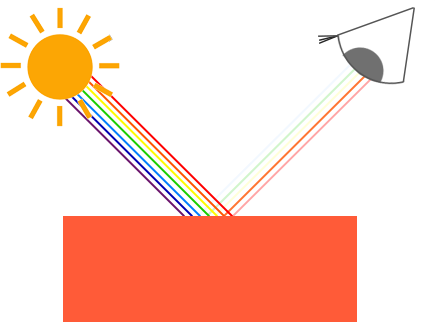
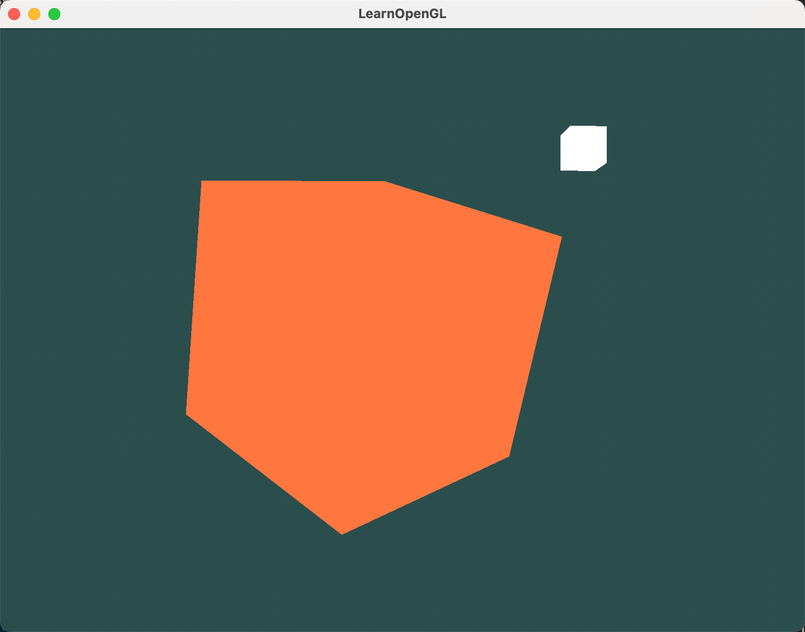

本文开始OpenGL光照方面的学习。在进入光照学习之前，需要先了解一下OpenGL中的颜色相关的知识。

## 0. 前期知识

本文代码在之前的文章基础上进行修改，如果你还没有看过之前的文章，可以点击下面的链接进行查看：https://blog.csdn.net/attitude93/category_9686278.html

文末有完整的代码，可以直接拿来运行和使用。

## 1. OpenGL中颜色的本质：数字
在 OpenGL 的世界里，颜色是用数字表示的。最常见的就是 RGB 模式，红（Red）、绿（Green）、蓝（Blue）三种颜色组合，几乎能调出所有颜色。

```cpp
glm::vec3 coral(1.0f, 0.5f, 0.31f);
```

上面这段代码，就定义了一个珊瑚红（Coral）的颜色。这里的 `glm::vec3` 是一个包含三个浮点数的向量，分别代表红、绿、蓝三种颜色的强度。每种颜色强度的范围是0到1（包括0和1），其中0表示没有该颜色，而 1 表示完全饱和的该颜色。

## 2. 看到的颜色：反射后的颜色

我们看到的颜色，并不是物体本身的颜色，而是它反射的光的颜色。就像一个蓝色的玩具，默认反射蓝色光，吸收其他颜色光。所以在 OpenGL 中，光源的颜色和物体的颜色相乘，就能得到最终的颜色。



```cpp
glm::vec3 lightColor(1.0f, 1.0f, 1.0f); // 白色光源
glm::vec3 toyColor(1.0f, 0.5f, 0.31f);  // 珊瑚红玩具
glm::vec3 result = lightColor * toyColor; // = (1.0f, 0.5f, 0.31f)
```

在这个例子中，玩具的颜色乘以光源颜色，就得到了它在白色光下的最终显示颜色。

我们可以通过物体对不同颜色光的反射来的得到意想不到的不到的颜色，从此创作颜色已经变得非常简单。例如以下代码：

```cpp
glm::vec3 lightColor(0.0f, 1.0f, 0.0f);
glm::vec3 toyColor(1.0f, 0.5f, 0.31f);
glm::vec3 result = lightColor * toyColor; // = (0.0f, 0.5f, 0.0f);
```

在这个例子中，光源变成了绿色。玩具的颜色乘以绿色的光，就得到了它在绿色光下的最终显示颜色（0.5f, 0.0f, 0.0f）。


## 3. 开始实操：创建光照场景

接下来，我们动手创建一个光照场景。首先，需要一个物体来代表光源，这里用一个立方体。然后，再加一个物体来模拟光照效果。这就像是搭建一个舞台，光源是聚光灯，物体是演员。

**我们需要将光源立方体和物体立方体的顶点着色器和片段着色器分开写，因为它们需要不同的处理。**

### 3.1 修改顶点着色器

#### 3.1.1 物体立方体

对于物体，顶点着色器我们可以继续沿用之前的代码。因为这里不需要纹理，所以你也可以将纹理相关的代码删掉。在这里，不删也不影响。

```glsl
#version 330 core
layout (location = 0) in vec3 aPos; // 位置变量的属性位置值为0
layout (location = 1) in vec2 aTexture; //纹理变量属性的位置为1，这里要与顶点形式对应，否则纹理不生效

uniform float offset_x;
out vec2 outTexture; // 输出顶点位置

uniform mat4 transform;
uniform mat4 model;
uniform mat4 view;
uniform mat4 projection;

void main()
{
    // 注意乘法要从右向左读
    gl_Position = projection * view * model * vec4(aPos, 1.0); // 注意我们如何把一个vec3作为vec4的构造器的参数
    outTexture = aTexture;
}
```

#### 3.1.2 光源立方体

我们还需要一个物体来代表光源，它代表光源在这个3D空间中的确切位置。简单起见，我们依然使用一个立方体来代表光源。

```glsl
#version 330 core
layout (location = 0) in vec3 aPos; // 位置变量的属性位置值为0

uniform mat4 model;
uniform mat4 view;
uniform mat4 projection;

void main()
{
    // 注意乘法要从右向左读
    gl_Position = projection * view * model * vec4(aPos, 1.0);
}

```

#### 3.1.3 光源立方体创建

有了光源的顶点着色器，接下来就是使用它，往里面传递光源的顶点数据。因为光源要独立，所以我们为这个灯创建一个新的VAO。

```cpp
GLuint lightVAO;
glGenVertexArrays(1, &lightVAO);
glBindVertexArray(lightVAO);
// 只需要绑定VBO不用再次设置VBO的数据，因为容器(物体)的VBO数据中已经包含了正确的立方体顶点数据
glBindBuffer(GL_ARRAY_BUFFER, VBO);
// 设置灯立方体的顶点属性指针(仅设置灯的顶点数据)
glVertexAttribPointer(0, 3, GL_FLOAT, GL_FALSE, 3 * sizeof(GLfloat), (GLvoid*)0);
glEnableVertexAttribArray(0);
glBindVertexArray(0);
```


### 3.2 修改片段着色器

#### 3.2.1 物体片段着色器

在原来的片段着色器基础上，我们只需要将光源颜色和物体颜色相乘即可: `FragColor = vec4(lightColor * objectColor, 1.0);`。（偷懒了，代码中纹理部分其实已经没用了，但没删除，不影响）

```glsl
#version 330 core
out vec4 FragColor;

in vec2 outTexture;

uniform vec3 objectColor;
uniform vec3 lightColor;

uniform sampler2D texture1;
uniform sampler2D texture2;

void main()
{
    FragColor = vec4(lightColor * objectColor, 1.0);
}
```

#### 3.2.2 物体颜色的创建

上面这个片段着色器接受两个分别表示物体颜色和光源颜色的uniform变量。正如一开始所说的一样，我们将光源的颜色与物体(能反射)的颜色相乘。下面在程序中，将这两个变量传入片段着色器。

```cpp
// 在此之前不要忘记首先'使用'对应的着色器程序(来设定uniform)
GLint objectColorLoc = glGetUniformLocation(lightingShader.Program, "objectColor");
GLint lightColorLoc  = glGetUniformLocation(lightingShader.Program, "lightColor");
glUniform3f(objectColorLoc, 1.0f, 0.5f, 0.31f);// 我们所熟悉的珊瑚红
glUniform3f(lightColorLoc,  1.0f, 1.0f, 1.0f); // 依旧把光源设置为白色
```

#### 3.2.3 光源片段着色器

光源的颜色不会变化，所以我们直接输出白色即可。

```glsl
#version 330 core
out vec4 FragColor;

void main()
{
    FragColor = vec4(1.0);
}
```

### 3.3 光源的位置

我们声明一个全局vec3变量来表示光源在场景的世界空间坐标中的位置。

```cpp
glm::vec3 lightPos(0.6f, 0.5f, 1.0f);
```
然后我们把灯平移到这儿，当然我们需要对它进行缩放，让它不那么明显：

```cpp
model = glm::mat4(1.0f);
model = glm::translate(model, lightPos);
model = glm::scale(model, glm::vec3(0.1f)); // 缩放
```

然后绘制光源立方体：

```cpp
lightSharder.use();
lightSharder.setMat4("projection", projection);
lightSharder.setMat4("view", view);
......
lightSharder.setMat4("model", model);

// 绘制灯立方体对象
glBindVertexArray(lightVAO);
glDrawArrays(GL_TRIANGLES, 0, 36);
```

### 3.4 运行

运行后，你将看到一个光源立方体和一个被照亮的物体。



## 4. 补充

总的来说，本文还是比较简单的，主要是为光源立方体写一个单独的顶点着色器和片段着色器，还有为光源立方体创建一个单独的VAO。

在创建VAO时，你可能也注意到了，我们并没有像之前那样，为光源立方体单独创建一个VBO，也没有再往光源立方体的VBO中填充顶点数据。这是因为光源立方体的顶点数据和物体立方体是一样的。所以我们可以重用之前的VBO即可。这里就能看出VAO和VBO的用处了。

完整代码可见：https://github.com/ZhangXj93/LearnOpenGL/tree/master/LearnOpenGL_base

