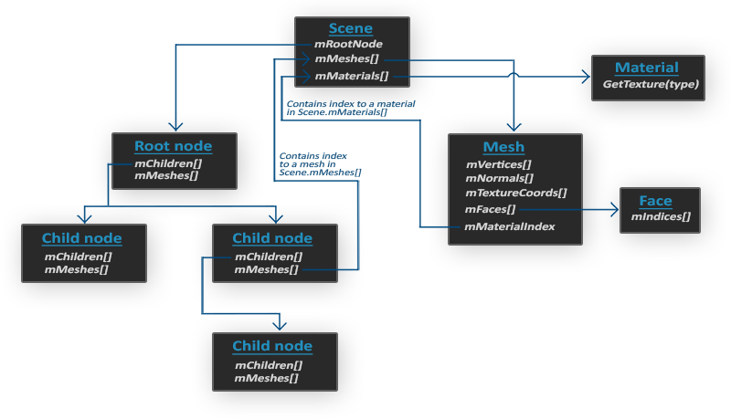
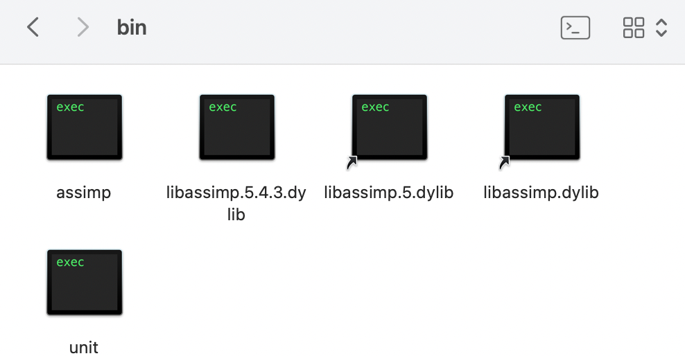
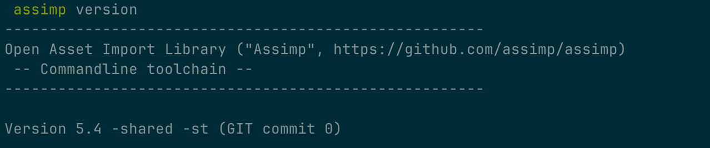
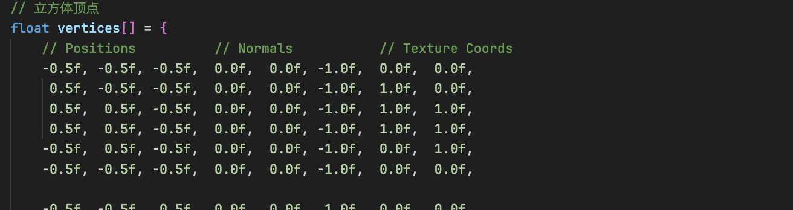
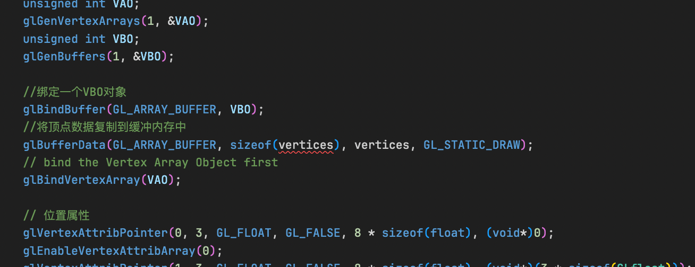
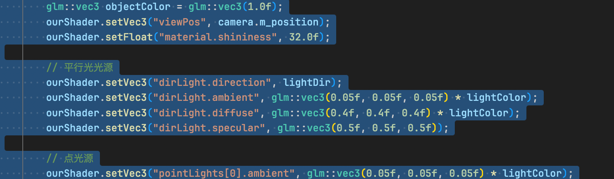
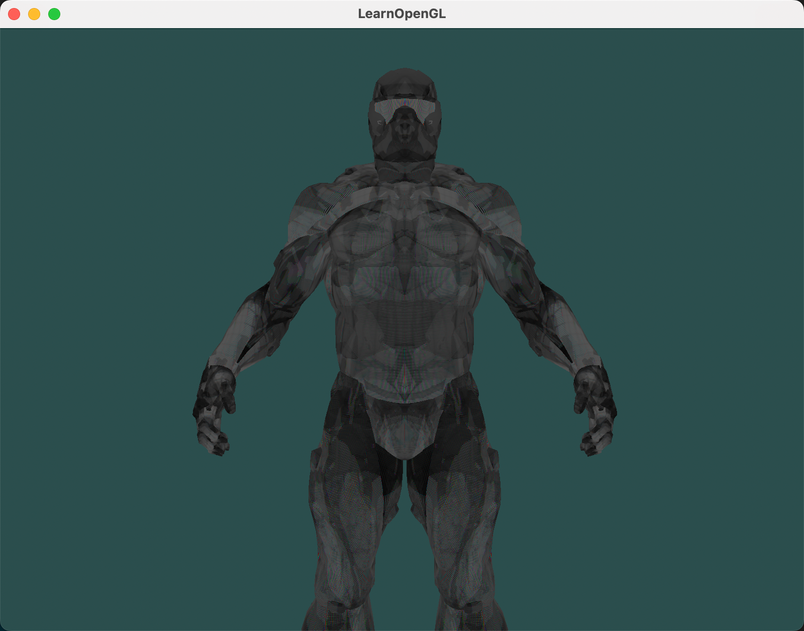

前面我们一直在用立方体作为例子，太枯燥了。立方体的顶点是固定的，我们手动就可以写出来。但是现实中，立方体是不够的，需要更加复杂的物体渲染。这些物体的顶点如何得到呢？

可以通过模型加载的方式实现顶点属性的获取。我们以 assimp 模型加载器为例，讲解如何加载模型，并获取顶点属性。


## 1. Assimp 模型加载介绍

Assimp，全称为Open Asset Import Library。Assimp可以导入几十种不同格式的模型文件（同样也可以导出部分模型格式）。只要Assimp加载完了模型文件，我们就可以从Assimp上获取所有我们需要的模型数据。Assimp把不同的模型文件都转换为一个统一的数据结构，所有无论我们导入何种格式的模型文件，都可以用同一个方式去访问我们需要的模型数据。

当导入一个模型文件时，即Assimp加载一整个包含所有模型和场景数据的模型文件到一个scene对象时，Assimp会为这个模型文件中的所有场景节点、模型节点都生成一个具有对应关系的数据结构，且将这些场景中的各种元素与模型数据对应起来。下图展示了一个简化的Assimp生成的模型文件数据结构：



- 所有的模型、场景数据都包含在scene对象中，如所有的材质和Mesh。同样，场景的根节点引用也包含在这个scene对象中
- 场景的根节点可能也会包含很多子节点和一个指向保存模型点云数据mMeshes[]的索引集合。根节点上的mMeshes[]里保存了实际了Mesh对象，而每个子节点上的mMesshes[]都只是指向根节点中的mMeshes[]的一个指针
- 一个Mesh对象本身包含渲染所需的所有相关数据，比如顶点位置、法线向量、纹理坐标、面片及物体的材质
- 一个Mesh会包含多个面片。一个Face（面片）表示渲染中的一个最基本的形状单位，即图元（基本图元有点、线、三角面片、矩形面片）。一个面片记录了一个图元的顶点索引，通过这个索引，可以在mMeshes[]中寻找到对应的顶点位置数据。顶点数据和索引分开存放，可以便于我们使用缓存（VBO、NBO、TBO、IBO）来高速渲染物体。
- 一个Mesh还会包含一个Material（材质）对象用于指定物体的一些材质属性。如颜色、纹理贴图（漫反射贴图、高光贴图等）

所以我们要做的第一件事，就是加载一个模型文件为scene对象，然后获取每个节点对应的Mesh对象（我们需要递归搜索每个节点的子节点来获取所有的节点），并处理每个Mesh对象对应的顶点数据、索引以及它的材质属性。最终我们得到一个只包含我们需要的数据的Mesh集合。

## 2. Assimp 库安装

我们采用源码编译的方式安装 Assimp 库。步骤如下：

(1) 下载 Assimp 源码

```bash
git clone https://github.com/assimp/assimp.git
```

(2) 通过 CMake 编译 Assimp

```bash
cd assimp
cmake CMakeLists.txt -DASSIMP_BUILD_ASSIMP_TOOLS=ON
cmake --build .
```

编译完成后，在 `bin` 文件夹下会生成 `assimp` 工具和库。






## 3. 使用 Assimp 加载模型

### 3.1 网格（Mesh）

**一个网格是我们在OpenGL中绘制物体的最小单位**。一个模型通常有多个网格组成。

那么网格应该有哪些属性呢？

思考我们前面的教程，给立方体顶点时，我们至少需要顶点坐标、法线、纹理坐标。

另外，一个网格也应该包含一个绘制用的纹理贴图，还有绘制数据的索引。

#### 3.1.1 顶点数据结构

首先，定义一个顶点数据结构：

```cpp
struct Vertex
{
    glm::vec3 Position;
    glm::vec3 Normal;
    glm::vec2 TexCoords;
};
```

#### 3.1.2 纹理数据结构

然后，定义一个纹理数据结构：

```cpp
struct Texture
{
    unsigned int id;
    std::string type; // 储存纹理的id和它的类型，比如diffuse纹理或者specular纹理。
};
```

#### 3.1.3 网格类定义

（1）首先，网格类需要包含顶点数据、索引数据和纹理数据。

```cpp
std::vector<Vertex> vertices;
std::vector<unsigned int> indices;
std::vector<Texture> textures;
```

（2）如何得到这些数据呢？

通过加载模型，创建每个Mesh实例时，可以将该Mesh的顶点数据、索引数据和纹理数据传递进来。

```cpp
Mesh::Mesh(std::vector<Vertex> vertices, std::vector<unsigned int> indices, std::vector<Texture> textures)
{
    this->vertices = vertices;
    this->indices = indices;
    this->textures = textures;

    // process vertices
    setupMesh();
}
```

（3）有了顶点数据，按之前的步骤，我们需要将顶点数据上传到着色器中，可以将这个操作封装到 setupMesh 函数中。不多在实现 setupMesh 函数之前，我们需要先定义 VAO、VBO、EBO。

```cpp
unsigned int _VAO, _VBO, _EBO;
```

（4）实现 setupMesh 函数：

```cpp
void Mesh::setupMesh()
{
    glGenVertexArrays(1, &_VAO);
    glGenBuffers(1, &_VBO);
    glGenBuffers(1, &_EBO);

    glBindVertexArray(_VAO);
    glBindBuffer(GL_ARRAY_BUFFER, _VBO);
    glBufferData(GL_ARRAY_BUFFER, vertices.size() * sizeof(Vertex), &vertices[0], GL_STATIC_DRAW);

    glBindBuffer(GL_ELEMENT_ARRAY_BUFFER, _EBO);
    glBufferData(GL_ELEMENT_ARRAY_BUFFER, indices.size() * sizeof(unsigned int), &indices[0], GL_STATIC_DRAW);

    // 设置顶点坐标指针
    glEnableVertexAttribArray(0); 
    glVertexAttribPointer(0, 3, GL_FLOAT, GL_FALSE, sizeof(Vertex), (GLvoid*)0);
    
    // 设置法线指针
    glEnableVertexAttribArray(1); 
    glVertexAttribPointer(1, 3, GL_FLOAT, GL_FALSE, sizeof(Vertex), (GLvoid*)offsetof(Vertex, Normal));
    
    // 设置顶点的纹理坐标
    glEnableVertexAttribArray(2); 
    glVertexAttribPointer(2, 2, GL_FLOAT, GL_FALSE, sizeof(Vertex), (GLvoid*)offsetof(Vertex, TexCoords));

    glBindVertexArray(0);
}
```

setupMesh 函数，主要是将我们之前创建 VAO、VBO、EBO 的代码封装起来，并设置顶点属性指针。

这里，重点关注下：

- `glBufferData(GL_ARRAY_BUFFER, vertices.size() * sizeof(Vertex), &vertices[0], GL_STATIC_DRAW);` 中，大小计算为 `vertices.size() * sizeof(Vertex)`，即顶点数量乘以每个顶点的大小。传递的数据是顶点数组的地址 `&vertices[0]` 。


- `offsetof(Vertex, Normal)`：一个预处理指令叫做`offsetof(s,m)`，把结构体作为它的第一个参数，第二个参数是这个结构体名字的变量。函数返回这个变量从结构体开始的字节偏移量（offset）。

（5）Mesh 作为一个绘制单元，我们也应该为其封装一个绘制函数 Draw：

```cpp
void Mesh::Draw(Shader &shader)
{
    unsigned int diffuseNr = 1;
    unsigned int specularNr = 1;

    for (unsigned int i = 0; i < textures.size(); i++)
    {
        glActiveTexture(GL_TEXTURE0 + i); // 在绑定纹理前需要激活适当的纹理单元
        // 检索纹理序列号 (N in diffuse_textureN)
        std::stringstream ss;
        std::string type = this->textures[i].type;
        if (type == "texture_diffuse")
        {
            ss << diffuseNr++;
        }
        else if (type == "texture_specular")
        {
            ss << specularNr++;
        }
        std::string number;
        number = ss.str(); // 转换整数为字符串
        shader.setInt("material." + type + number, i);
        glBindTexture(GL_TEXTURE_2D, textures[i].id);
    }

    shader.setFloat("material.shininess", 32.0f);

    glBindVertexArray(_VAO);
    glDrawElements(GL_TRIANGLES, indices.size(), GL_UNSIGNED_INT, 0);
    glBindVertexArray(0);
}
```

其中，重点关注：

- `shader.setInt("material." + type + number, i);`：将纹理单元绑定到着色器中。

- `glBindTexture(GL_TEXTURE_2D, textures[i].id);`：将纹理绑定到纹理单元。


（6）最终，Mesh 类定义如下：

```cpp
class Mesh
{
public:
    Mesh(std::vector<Vertex> vertices, std::vector<unsigned int> indices, std::vector<Texture> textures);
    void Draw(Shader &shader);

public:
    std::vector<Vertex> vertices;
    std::vector<unsigned int> indices;
    std::vector<Texture> textures;

private:
    void setupMesh();
    
private:
    unsigned int _VAO;
    unsigned int _VBO;
    unsigned int _EBO;
};
```


### 3.2 模型(Model)

模型类，用来加载模型文件，解析模型文件成含多个网格。

#### 3.2.1 模型类属性

所以，模型类需要包含一个网格数组，用来存储多个网格，还需要一个模型文件的路径。

```cpp
std::vector<Mesh> meshes;
std::string directory;
```

#### 3.2.2 加载模型

首先，需要一个 loadModel 函数，用来加载模型文件。

```cpp
void Model::loadModel(const std::string& path)
{
    Assimp::Importer import;
    const aiScene* scene = import.ReadFile(path, aiProcess_Triangulate | aiProcess_FlipUVs); 

    if(!scene || scene->mFlags == AI_SCENE_FLAGS_INCOMPLETE || !scene->mRootNode) 
    {
        std::cout << "ERROR::ASSIMP::" << import.GetErrorString() << std::endl;
        return;
    }
    this->directory = path.substr(0, path.find_last_of('/'));

    this->processNode(scene->mRootNode, scene);
}
```

#### 3.2.3 从模型中提取数据

通过上面的加载模型，我们得到了根节点，通过根节点，我们需要提取组成网格的数据，一层一层解析：

- processNode ---> processMesh

- processMesh中
  - 提取顶点数据，包括顶点坐标、法线、纹理坐标。
  - 提取索引数据。
  - 提取纹理资源，加载纹理。


```cpp
void Model::processNode(aiNode* node, const aiScene* scene)
{
    // 添加当前节点中的所有Mesh
    for(unsigned int i = 0; i < node->mNumMeshes; i++)
    {
        aiMesh* mesh = scene->mMeshes[node->mMeshes[i]]; 
        this->meshes.push_back(this->processMesh(mesh, scene)); 
    }
    // 递归处理该节点的子孙节点
    for(unsigned int i = 0; i < node->mNumChildren; i++)
    {
        this->processNode(node->mChildren[i], scene);
    }
}

Mesh Model::processMesh(aiMesh* mesh, const aiScene* scene)
{
    // 要提取的数据
    std::vector<Vertex> vertices;
    std::vector<GLuint> indices;
    std::vector<Texture> textures;

    // 遍历每个mesh的顶点数据
    for(unsigned int i = 0; i < mesh->mNumVertices; i++)
    {
        Vertex vertex;
        glm::vec3 vector; 
        // Positions
        vector.x = mesh->mVertices[i].x;
        vector.y = mesh->mVertices[i].y;
        vector.z = mesh->mVertices[i].z;
        vertex.Position = vector;
        // Normals
        vector.x = mesh->mNormals[i].x;
        vector.y = mesh->mNormals[i].y;
        vector.z = mesh->mNormals[i].z;
        vertex.Normal = vector;
        // Texture Coordinates
        if(mesh->mTextureCoords[0]) // mesh中存在纹理坐标
        {
            glm::vec2 vec;
            // 一个顶点可以有多个纹理坐标，这里假设只包含一个，直接使用第一个纹理坐标
            vec.x = mesh->mTextureCoords[0][i].x; 
            vec.y = mesh->mTextureCoords[0][i].y;
            vertex.TexCoords = vec;
        }
        else
        {
            vertex.TexCoords = glm::vec2(0.0f, 0.0f);
        }
        vertices.push_back(vertex);
    }

    // 下面，提取顶点的索引数据
    for(unsigned int i = 0; i < mesh->mNumFaces; i++)
    {
        aiFace face = mesh->mFaces[i];
        for(unsigned int j = 0; j < face.mNumIndices; j++)
        {
            indices.push_back(face.mIndices[j]);
        }
    }

    // 提取材质信息 materials
    if(mesh->mMaterialIndex >= 0)
    {
        aiMaterial* material = scene->mMaterials[mesh->mMaterialIndex];
        // We assume a convention for sampler names in the shaders. Each diffuse texture should be named
        // as 'texture_diffuseN' where N is a sequential number ranging from 1 to MAX_SAMPLER_NUMBER. 
        // Same applies to other texture as the following list summarizes:
        // Diffuse: texture_diffuseN
        // Specular: texture_specularN
        // Normal: texture_normalN

        // 1. Diffuse maps
        std::vector<Texture> diffuseMaps = this->loadMaterialTextures(material, aiTextureType_DIFFUSE, "texture_diffuse");
        textures.insert(textures.end(), diffuseMaps.begin(), diffuseMaps.end());
        // 2. Specular maps
        std::vector<Texture> specularMaps = this->loadMaterialTextures(material, aiTextureType_SPECULAR, "texture_specular");
        textures.insert(textures.end(), specularMaps.begin(), specularMaps.end());
    }
    
    // 返回一个 Mesh 实例
    return Mesh(vertices, indices, textures);
}

std::vector<Texture> Model::loadMaterialTextures(aiMaterial* mat, aiTextureType type, std::string typeName)
{
    std::vector<Texture> textures;
    for(unsigned int i = 0; i < mat->GetTextureCount(type); i++)
    {
        aiString str;
        mat->GetTexture(type, i, &str);
        Texture texture;
        texture.id = TextureFromFile(str.C_Str(), this->directory);
        texture.type = typeName;
        // texture.path = str;
        textures.push_back(texture);
    }
    return textures;
}

unsigned int Model::TextureFromFile(const char* path, const std::string &directory)
{
    // 生成 texture ID 并加载纹理数据
    std::string filename = std::string(path);
    filename = directory + '/' + filename;
    GLuint textureID;
    glGenTextures(1, &textureID);
    int width, height, nrChannels;
    unsigned char* image = stbi_load(filename.c_str(), &width, &height, &nrChannels, 0);
    // Assign texture to ID
    glBindTexture(GL_TEXTURE_2D, textureID);
    glTexImage2D(GL_TEXTURE_2D, 0, GL_RGB, width, height, 0, GL_RGB, GL_UNSIGNED_BYTE, image);
    glGenerateMipmap(GL_TEXTURE_2D);	

    // Parameters
    glTexParameteri( GL_TEXTURE_2D, GL_TEXTURE_WRAP_S, GL_REPEAT );
    glTexParameteri( GL_TEXTURE_2D, GL_TEXTURE_WRAP_T, GL_REPEAT );
    glTexParameteri( GL_TEXTURE_2D, GL_TEXTURE_MIN_FILTER, GL_LINEAR_MIPMAP_LINEAR );
    glTexParameteri( GL_TEXTURE_2D, GL_TEXTURE_MAG_FILTER, GL_LINEAR);
    glBindTexture(GL_TEXTURE_2D, 0);
    stbi_image_free(image);
    return textureID;
}
```

#### 3.2.4 最终类定义

```cpp
class Model
{
public:
    Model(const std::string &path);

    void Draw(Shader &shader);
private:
    void loadModel(const std::string &path);
    void processNode(aiNode *node, const aiScene *scene);
    Mesh processMesh(aiMesh *mesh, const aiScene *scene);
    std::vector<Texture> loadMaterialTextures(aiMaterial *mat, aiTextureType type, std::string typeName);
    unsigned int TextureFromFile(const char* path, const std::string &directory);
    
private:
    std::vector<Mesh> meshes;
    std::string directory;

};
```

## 4. 着色器编写

本文先用一个简单的着色器来渲染模型。

### 4.1 顶点着色器

```glsl
#version 330 core
layout (location = 0) in vec3 position;
layout (location = 1) in vec3 normal;
layout (location = 2) in vec2 texCoords;

out vec2 TexCoords;

uniform mat4 model;
uniform mat4 view;
uniform mat4 projection;

void main()
{
    gl_Position = projection * view * model * vec4(position, 1.0f);
    TexCoords = texCoords;
}
```

### 4.2 片段着色器

```glsl
#version 330 core

in vec2 TexCoords;

out vec4 color;

struct Material {
    sampler2D texture_diffuse1;
    float shininess;
};
uniform Material material;

void main()
{    
    color = vec4(texture(material.texture_diffuse1, TexCoords));
}
```

## 5. 主程序修改 - 加载模型，渲染模型

（1）顶点数据、索引数据、纹理数据的加载，VBO、VAO、EBO的创建，都已经封装在了Model类和Mesh类中。所以原来主程序中的以下代码就不用了，删掉。









（2）在主程序中创建一个Model实例，并调用Draw函数即可。

```cpp
Model ourModel(PROJECT_PATH + "/resource/models/nanosuit/nanosuit.obj");

...
while(!glfwWindowShouldClose(window))
{
    ...
    ourModel.Draw(ourShader);
    ...
}

```

## 5. 运行结果




**篇幅有限，完整程序可私信我获取。**