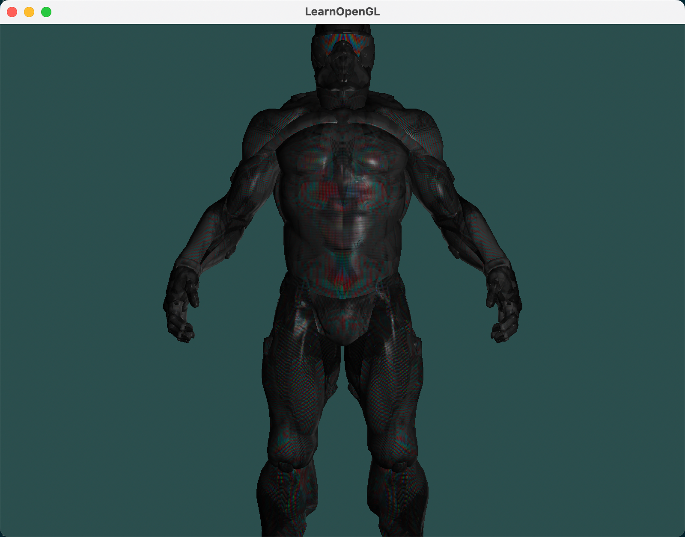
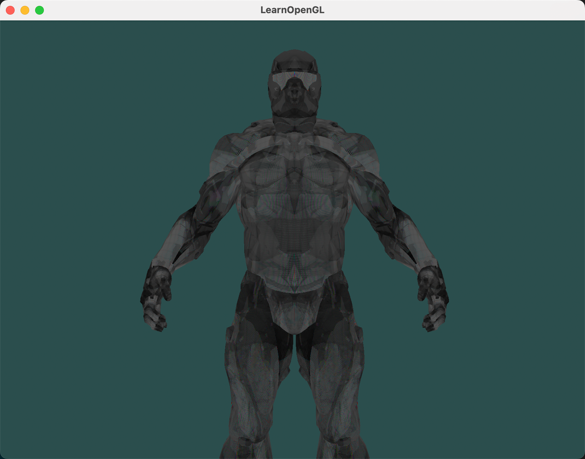

上篇文章我们实现了 Assimp 模型库的安装，并使用 Assimp 模型库加载了一个模型并进行了渲染。本文我们在此基础上，添加光照效果，巩固下学到的知识。

## 1. 修改顶点着色器

点光源的光照计算，需要知道法线方向和片段着色器位置，所以我们在顶点着色器中输出这两个值。

```glsl
out vec3 outNormal; // 输出法线位置
out vec3 outFragPos; // 输出片段着色器位置

......

outFragPos = vec3(model * vec4(aPos, 1.0));
outNormal = aNormal;
```

## 2. 修改片段着色器

在片段着色器中，我们使用点光源的光照计算函数，计算每个点光源对当前片段着色器的影响，并累加到最终颜色中。主要的修改如下：

（1）接收法线和片段着色器位置

（2）定义点光源结构体和点光源数组

（3）点光源光照计算需要 viewPos 变量

（4）实现点光源光照计算函数

（5）点光源数组遍历，计算每个点光源对当前片段着色器的影响，最后累加到最终颜色中。

```glsl
......

in vec3 outNormal;
in vec3 outFragPos;

struct PointLight {
    vec3 position;
    vec3 ambient;
    vec3 diffuse;
    vec3 specular;
    float constant;
    float linear;
    float quadratic;
};
#define NR_POINT_LIGHTS 4
uniform PointLight pointLights[NR_POINT_LIGHTS];

uniform vec3 viewPos;

vec3 calculatePointLight(PointLight light, vec3 normal, vec3 viewDir, vec3 fragPos)
{
    vec3 lightDir = normalize(light.position - fragPos);
    // 计算漫反射强度
    float diff = max(dot(normal, lightDir), 0.0);
    // 计算镜面反射
    vec3 reflectDir = reflect(-lightDir, normal);
    float spec = pow(max(dot(viewDir, reflectDir), 0.0), material.shininess);
    // 计算衰减
    float distance = length(light.position - fragPos);
    float attenuation = 1.0f / (light.constant + light.linear * distance + light.quadratic * (distance * distance));
    // 将各个分量合并
    vec3 ambient  = light.ambient  * vec3(texture(material.diffuse, TexCoords));
    vec3 diffuse  = light.diffuse  * diff * vec3(texture(material.diffuse, TexCoords));
    vec3 specular = light.specular * spec * vec3(texture(material.specular, TexCoords));
    ambient  *= attenuation;
    diffuse  *= attenuation;
    specular *= attenuation;
    return (ambient + diffuse + specular);
}

void main()
{    
    vec3 normal = normalize(outNormal);
    vec3 viewDir = normalize(viewPos - outFragPos);

    vec3 finalColor = vec3(0.0);
    for(int i = 0; i < NR_POINT_LIGHTS; i++)
    {
        finalColor += calculatePointLight(pointLights[i], normal, viewDir, outFragPos);
    }

    color = vec4(finalColor, 1.0);
}
```

## 3. 修改 C++ 代码

（1）在片段着色器中，我们使用了 `viewPos` 变量，所以需要在 C++ 代码中设置这个变量。

（2）在片段着色器中，我们使用了 `PointLight` 结构体，所以需要在 C++ 代码中设置这个结构体。

```cpp
......

// 点光源
glm::vec3 lightColor = glm::vec3(1.0f, 0.0f, 1.0f);
ourShader.setVec3("pointLights[0].ambient", glm::vec3(0.05f, 0.05f, 0.05f) * lightColor);
ourShader.setVec3("pointLights[0].diffuse", glm::vec3(0.8f, 0.8f, 0.8f) * lightColor);
ourShader.setVec3("pointLights[0].specular", glm::vec3(1.0f, 1.0f, 1.0f));
ourShader.setFloat("pointLights[0].constant", 1.0f);
ourShader.setFloat("pointLights[0].linear", 0.09f);
ourShader.setFloat("pointLights[0].quadratic", 0.032f);
ourShader.setVec3("pointLights[0].position", pointLightPositions[0]);

ourShader.setVec3("pointLights[1].ambient", glm::vec3(0.05f, 0.05f, 0.05f) * lightColor);
ourShader.setVec3("pointLights[1].diffuse", glm::vec3(0.8f, 0.8f, 0.8f) * lightColor);
ourShader.setVec3("pointLights[1].specular", glm::vec3(1.0f, 1.0f, 1.0f));
ourShader.setFloat("pointLights[1].constant", 1.0f);
ourShader.setFloat("pointLights[1].linear", 0.09f);
ourShader.setFloat("pointLights[1].quadratic", 0.032f);
ourShader.setVec3("pointLights[1].position", pointLightPositions[1]);

ourShader.setVec3("pointLights[2].ambient", glm::vec3(0.05f, 0.05f, 0.05f) * lightColor);
ourShader.setVec3("pointLights[2].diffuse", glm::vec3(0.8f, 0.8f, 0.8f) * lightColor);
ourShader.setVec3("pointLights[2].specular", glm::vec3(1.0f, 1.0f, 1.0f));
ourShader.setFloat("pointLights[2].constant", 1.0f);
ourShader.setFloat("pointLights[2].linear", 0.09f);
ourShader.setFloat("pointLights[2].quadratic", 0.032f);
ourShader.setVec3("pointLights[2].position", pointLightPositions[2]);

ourShader.setVec3("pointLights[3].ambient", glm::vec3(0.05f, 0.05f, 0.05f) * lightColor);
ourShader.setVec3("pointLights[3].diffuse", glm::vec3(0.8f, 0.8f, 0.8f) * lightColor);
ourShader.setVec3("pointLights[3].specular", glm::vec3(1.0f, 1.0f, 1.0f));
ourShader.setFloat("pointLights[3].constant", 1.0f);
ourShader.setFloat("pointLights[3].linear", 0.09f);
ourShader.setFloat("pointLights[3].quadratic", 0.032f);
ourShader.setVec3("pointLights[3].position",pointLightPositions[3]);

```

## 4. 运行效果

添加光照后：



对比没有光照前：



美观了很多！


**篇幅有限，完整程序可私信我获取。**